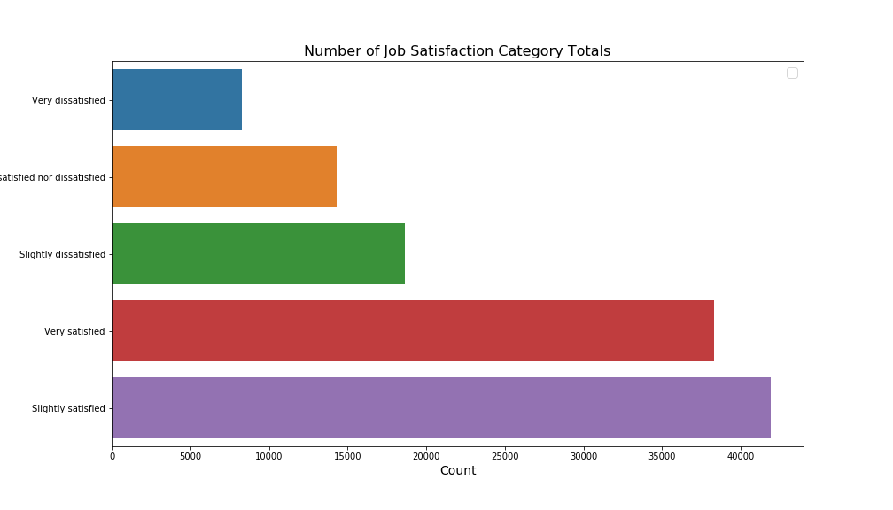

# Stackoverflow survey data

# Please Visit Blog Link :  https://medium.com/@hemprasad.badgujar/it-has-no-borders-how-to-pick-a-best-it-resources-from-right-country-at-the-appropriate-274a40f590f

## Data Analysis Process
1. Business Understanding to define Problem statement.
1.  Data Understanding.
2.  Prepare Data.
3.  Data Modeling.
4.  Evaluate the Results
5.  Deploy.

## Business Understanding to define Problem statement.

***I want to set up a software development businesses worldwide and hire developers from the respective countries. in that process, I want to learn about technologies used by developers in software development. which country and tools I have to target based on the satisfaction level of developer and lastly How much I have to pay for a respective developer from respective countries ***


## Problem Statement Includes 
- Which are the Most popular software development scenarios used by developers in year 2019 in different countries  ?
- Job satisfaction ratio and career satisfaction with different coding languages in different countries ?
- What should be My Appropriate budget to pay for developers ?

# Dataset and Data Understanding Solution Progress

## Header for import


```python
import numpy as np
import pandas as pd
pd.set_option('display.max_rows', 500)
pd.set_option('display.max_columns', 500)
pd.set_option('display.width', 1000)
import matplotlib.pyplot as plt
from collections import Counter
import seaborn as sns
import re
import collections
import matplotlib as mpl
mpl.rcParams['savefig.dpi'] = 100
mpl.rcParams['figure.dpi'] = 100
%matplotlib inline
%config InlineBackend.print_figure_kwargs={'bbox_inches':None}
from plotnine import *
from feature_selector import FeatureSelector
```

## Data import from Developer Survey


```python
df_2019 = pd.read_csv(r'.\data\developer_survey_2019\survey_results_public.csv')
```


```python
df_2018 = pd.read_csv(r'.\data\developer_survey_2018\survey_results_public.csv',low_memory=False)
```


```python
df_2017 = pd.read_csv(r'.\data\developer_survey_2017\survey_results_public.csv',low_memory=False)
```


```python
df_2019_schema  = pd.read_csv(r'.\data\developer_survey_2019\survey_results_schema.csv')
```


```python
df_2018_schema  = pd.read_csv(r'.\data\developer_survey_2018\survey_results_schema.csv')
```


```python
df_2017_schema  = pd.read_csv(r'.\data\developer_survey_2017\survey_results_schema.csv')
```

## Data Understanding and Presentation 


```python
df_2019.head(2)
```


<div>
<style scoped>
    .dataframe tbody tr th:only-of-type {
        vertical-align: middle;
    }

    .dataframe tbody tr th {
        vertical-align: top;
    }

    .dataframe thead th {
        text-align: right;
    }
</style>
<table border="1" class="dataframe">
  <thead>
    <tr style="text-align: right;">
      <th></th>
      <th>Respondent</th>
      <th>MainBranch</th>
      <th>Hobbyist</th>
      <th>OpenSourcer</th>
      <th>OpenSource</th>
      <th>Employment</th>
      <th>Country</th>
      <th>Student</th>
      <th>EdLevel</th>
      <th>UndergradMajor</th>
      <th>EduOther</th>
      <th>OrgSize</th>
      <th>DevType</th>
      <th>YearsCode</th>
      <th>Age1stCode</th>
      <th>YearsCodePro</th>
      <th>CareerSat</th>
      <th>JobSat</th>
      <th>MgrIdiot</th>
      <th>MgrMoney</th>
      <th>MgrWant</th>
      <th>JobSeek</th>
      <th>LastHireDate</th>
      <th>LastInt</th>
      <th>FizzBuzz</th>
      <th>JobFactors</th>
      <th>ResumeUpdate</th>
      <th>CurrencySymbol</th>
      <th>CurrencyDesc</th>
      <th>CompTotal</th>
      <th>CompFreq</th>
      <th>ConvertedComp</th>
      <th>WorkWeekHrs</th>
      <th>WorkPlan</th>
      <th>WorkChallenge</th>
      <th>WorkRemote</th>
      <th>WorkLoc</th>
      <th>ImpSyn</th>
      <th>CodeRev</th>
      <th>CodeRevHrs</th>
      <th>UnitTests</th>
      <th>PurchaseHow</th>
      <th>PurchaseWhat</th>
      <th>LanguageWorkedWith</th>
      <th>LanguageDesireNextYear</th>
      <th>DatabaseWorkedWith</th>
      <th>DatabaseDesireNextYear</th>
      <th>PlatformWorkedWith</th>
      <th>PlatformDesireNextYear</th>
      <th>WebFrameWorkedWith</th>
      <th>WebFrameDesireNextYear</th>
      <th>MiscTechWorkedWith</th>
      <th>MiscTechDesireNextYear</th>
      <th>DevEnviron</th>
      <th>OpSys</th>
      <th>Containers</th>
      <th>BlockchainOrg</th>
      <th>BlockchainIs</th>
      <th>BetterLife</th>
      <th>ITperson</th>
      <th>OffOn</th>
      <th>SocialMedia</th>
      <th>Extraversion</th>
      <th>ScreenName</th>
      <th>SOVisit1st</th>
      <th>SOVisitFreq</th>
      <th>SOVisitTo</th>
      <th>SOFindAnswer</th>
      <th>SOTimeSaved</th>
      <th>SOHowMuchTime</th>
      <th>SOAccount</th>
      <th>SOPartFreq</th>
      <th>SOJobs</th>
      <th>EntTeams</th>
      <th>SOComm</th>
      <th>WelcomeChange</th>
      <th>SONewContent</th>
      <th>Age</th>
      <th>Gender</th>
      <th>Trans</th>
      <th>Sexuality</th>
      <th>Ethnicity</th>
      <th>Dependents</th>
      <th>SurveyLength</th>
      <th>SurveyEase</th>
    </tr>
  </thead>
  <tbody>
    <tr>
      <th>0</th>
      <td>1</td>
      <td>I am a student who is learning to code</td>
      <td>Yes</td>
      <td>Never</td>
      <td>The quality of OSS and closed source software ...</td>
      <td>Not employed, and not looking for work</td>
      <td>United Kingdom</td>
      <td>No</td>
      <td>Primary/elementary school</td>
      <td>NaN</td>
      <td>Taught yourself a new language, framework, or ...</td>
      <td>NaN</td>
      <td>NaN</td>
      <td>4</td>
      <td>10</td>
      <td>NaN</td>
      <td>NaN</td>
      <td>NaN</td>
      <td>NaN</td>
      <td>NaN</td>
      <td>NaN</td>
      <td>NaN</td>
      <td>NaN</td>
      <td>NaN</td>
      <td>NaN</td>
      <td>NaN</td>
      <td>NaN</td>
      <td>NaN</td>
      <td>NaN</td>
      <td>NaN</td>
      <td>NaN</td>
      <td>NaN</td>
      <td>NaN</td>
      <td>NaN</td>
      <td>NaN</td>
      <td>NaN</td>
      <td>NaN</td>
      <td>NaN</td>
      <td>NaN</td>
      <td>NaN</td>
      <td>NaN</td>
      <td>NaN</td>
      <td>NaN</td>
      <td>HTML/CSS;Java;JavaScript;Python</td>
      <td>C;C++;C#;Go;HTML/CSS;Java;JavaScript;Python;SQL</td>
      <td>SQLite</td>
      <td>MySQL</td>
      <td>MacOS;Windows</td>
      <td>Android;Arduino;Windows</td>
      <td>Django;Flask</td>
      <td>Flask;jQuery</td>
      <td>Node.js</td>
      <td>Node.js</td>
      <td>IntelliJ;Notepad++;PyCharm</td>
      <td>Windows</td>
      <td>I do not use containers</td>
      <td>NaN</td>
      <td>NaN</td>
      <td>Yes</td>
      <td>Fortunately, someone else has that title</td>
      <td>Yes</td>
      <td>Twitter</td>
      <td>Online</td>
      <td>Username</td>
      <td>2017</td>
      <td>A few times per month or weekly</td>
      <td>Find answers to specific questions;Learn how t...</td>
      <td>3-5 times per week</td>
      <td>Stack Overflow was much faster</td>
      <td>31-60 minutes</td>
      <td>No</td>
      <td>NaN</td>
      <td>No, I didn't know that Stack Overflow had a jo...</td>
      <td>No, and I don't know what those are</td>
      <td>Neutral</td>
      <td>Just as welcome now as I felt last year</td>
      <td>Tech articles written by other developers;Indu...</td>
      <td>14.0</td>
      <td>Man</td>
      <td>No</td>
      <td>Straight / Heterosexual</td>
      <td>NaN</td>
      <td>No</td>
      <td>Appropriate in length</td>
      <td>Neither easy nor difficult</td>
    </tr>
    <tr>
      <th>1</th>
      <td>2</td>
      <td>I am a student who is learning to code</td>
      <td>No</td>
      <td>Less than once per year</td>
      <td>The quality of OSS and closed source software ...</td>
      <td>Not employed, but looking for work</td>
      <td>Bosnia and Herzegovina</td>
      <td>Yes, full-time</td>
      <td>Secondary school (e.g. American high school, G...</td>
      <td>NaN</td>
      <td>Taken an online course in programming or softw...</td>
      <td>NaN</td>
      <td>Developer, desktop or enterprise applications;...</td>
      <td>NaN</td>
      <td>17</td>
      <td>NaN</td>
      <td>NaN</td>
      <td>NaN</td>
      <td>NaN</td>
      <td>NaN</td>
      <td>NaN</td>
      <td>I am actively looking for a job</td>
      <td>I've never had a job</td>
      <td>NaN</td>
      <td>NaN</td>
      <td>Financial performance or funding status of the...</td>
      <td>Something else changed (education, award, medi...</td>
      <td>NaN</td>
      <td>NaN</td>
      <td>NaN</td>
      <td>NaN</td>
      <td>NaN</td>
      <td>NaN</td>
      <td>NaN</td>
      <td>NaN</td>
      <td>NaN</td>
      <td>NaN</td>
      <td>NaN</td>
      <td>NaN</td>
      <td>NaN</td>
      <td>NaN</td>
      <td>NaN</td>
      <td>NaN</td>
      <td>C++;HTML/CSS;Python</td>
      <td>C++;HTML/CSS;JavaScript;SQL</td>
      <td>NaN</td>
      <td>MySQL</td>
      <td>Windows</td>
      <td>Windows</td>
      <td>Django</td>
      <td>Django</td>
      <td>NaN</td>
      <td>NaN</td>
      <td>Atom;PyCharm</td>
      <td>Windows</td>
      <td>I do not use containers</td>
      <td>NaN</td>
      <td>Useful across many domains and could change ma...</td>
      <td>Yes</td>
      <td>Yes</td>
      <td>Yes</td>
      <td>Instagram</td>
      <td>Online</td>
      <td>Username</td>
      <td>2017</td>
      <td>Daily or almost daily</td>
      <td>Find answers to specific questions;Learn how t...</td>
      <td>3-5 times per week</td>
      <td>Stack Overflow was much faster</td>
      <td>11-30 minutes</td>
      <td>Yes</td>
      <td>A few times per month or weekly</td>
      <td>No, I knew that Stack Overflow had a job board...</td>
      <td>No, and I don't know what those are</td>
      <td>Yes, somewhat</td>
      <td>Just as welcome now as I felt last year</td>
      <td>Tech articles written by other developers;Indu...</td>
      <td>19.0</td>
      <td>Man</td>
      <td>No</td>
      <td>Straight / Heterosexual</td>
      <td>NaN</td>
      <td>No</td>
      <td>Appropriate in length</td>
      <td>Neither easy nor difficult</td>
    </tr>
  </tbody>
</table>
</div>


```python
# df_2018.head(2)
```


```python
# df_2017.head(2)
```


```python
for col in df_2019.columns:
    print(col) 
```

    Respondent
    MainBranch
    Hobbyist
    OpenSourcer
    OpenSource
    Employment
    Country
    Student
    EdLevel
    UndergradMajor
    EduOther
    OrgSize
    DevType
    YearsCode
    Age1stCode
    YearsCodePro
    CareerSat
    JobSat
    MgrIdiot
    MgrMoney
    MgrWant
    JobSeek
    LastHireDate
    LastInt
    FizzBuzz
    JobFactors
    ResumeUpdate
    CurrencySymbol
    CurrencyDesc
    CompTotal
    CompFreq
    ConvertedComp
    WorkWeekHrs
    WorkPlan
    WorkChallenge
    WorkRemote
    WorkLoc
    ImpSyn
    CodeRev
    CodeRevHrs
    UnitTests
    PurchaseHow
    PurchaseWhat
    LanguageWorkedWith
    LanguageDesireNextYear
    DatabaseWorkedWith
    DatabaseDesireNextYear
    PlatformWorkedWith
    PlatformDesireNextYear
    WebFrameWorkedWith
    WebFrameDesireNextYear
    MiscTechWorkedWith
    MiscTechDesireNextYear
    DevEnviron
    OpSys
    Containers
    BlockchainOrg
    BlockchainIs
    BetterLife
    ITperson
    OffOn
    SocialMedia
    Extraversion
    ScreenName
    SOVisit1st
    SOVisitFreq
    SOVisitTo
    SOFindAnswer
    SOTimeSaved
    SOHowMuchTime
    SOAccount
    SOPartFreq
    SOJobs
    EntTeams
    SOComm
    WelcomeChange
    SONewContent
    Age
    Gender
    Trans
    Sexuality
    Ethnicity
    Dependents
    SurveyLength
    SurveyEase
    


```python
# for col in df_2017.columns:
#     print(col) 
```

## Selecting last year for analysis 


```python
df_country_count = df_2019.groupby(['Country'])['Respondent'].count().sort_values(ascending=False)
# df_country_count
```

# Most popular software development scenarios used by developers in year 2019 in different countries ?

## Selecting my favorable Counties


```python
df_country_list = [
'United Kingdom', 'United States', 'Canada', 'India', 'Germany', 'Australia', 'Russian Federation', 'Brazil', 'Spain', 'France', 'Netherlands'
]
```

## Selecting target attributes used for analysis 


```python
# Attributes list
target_attributes = [
    # Background
    'Country',
    'YearsCode',
    'DevType',
    'YearsCodePro',
    'CareerSat',
    'Gender',
    # Technologies
    'LanguageWorkedWith',
    'LanguageDesireNextYear',
    'DatabaseWorkedWith',
    'DatabaseDesireNextYear',
    'PlatformWorkedWith',
    'PlatformDesireNextYear',
    'OpSys',
    'Sexuality',
    'DevType'
]
```


## Prepare Data - filter by countries


```python
df_2019_top = df_2019[df_2019.Country.isin(df_country_list)] # filter by countries
# df_2019_top
```

## Prepare Data -  filter by attributes


```python
df_2019_top_filterd = df_2019_top[target_attributes] # filter by attributes
df_2019_top_filterd.head()
```


<div>
<style scoped>
    .dataframe tbody tr th:only-of-type {
        vertical-align: middle;
    }

    .dataframe tbody tr th {
        vertical-align: top;
    }

    .dataframe thead th {
        text-align: right;
    }
</style>
<table border="1" class="dataframe">
  <thead>
    <tr style="text-align: right;">
      <th></th>
      <th>Country</th>
      <th>YearsCode</th>
      <th>DevType</th>
      <th>YearsCodePro</th>
      <th>CareerSat</th>
      <th>Gender</th>
      <th>LanguageWorkedWith</th>
      <th>LanguageDesireNextYear</th>
      <th>DatabaseWorkedWith</th>
      <th>DatabaseDesireNextYear</th>
      <th>PlatformWorkedWith</th>
      <th>PlatformDesireNextYear</th>
      <th>OpSys</th>
      <th>Sexuality</th>
      <th>DevType</th>
    </tr>
  </thead>
  <tbody>
    <tr>
      <th>0</th>
      <td>United Kingdom</td>
      <td>4</td>
      <td>NaN</td>
      <td>NaN</td>
      <td>NaN</td>
      <td>Man</td>
      <td>HTML/CSS;Java;JavaScript;Python</td>
      <td>C;C++;C#;Go;HTML/CSS;Java;JavaScript;Python;SQL</td>
      <td>SQLite</td>
      <td>MySQL</td>
      <td>MacOS;Windows</td>
      <td>Android;Arduino;Windows</td>
      <td>Windows</td>
      <td>Straight / Heterosexual</td>
      <td>NaN</td>
    </tr>
    <tr>
      <th>3</th>
      <td>United States</td>
      <td>3</td>
      <td>Developer, full-stack</td>
      <td>Less than 1 year</td>
      <td>Very satisfied</td>
      <td>Man</td>
      <td>C;C++;C#;Python;SQL</td>
      <td>C;C#;JavaScript;SQL</td>
      <td>MySQL;SQLite</td>
      <td>MySQL;SQLite</td>
      <td>Linux;Windows</td>
      <td>Linux;Windows</td>
      <td>Windows</td>
      <td>Straight / Heterosexual</td>
      <td>Developer, full-stack</td>
    </tr>
    <tr>
      <th>5</th>
      <td>Canada</td>
      <td>13</td>
      <td>Data or business analyst;Data scientist or mac...</td>
      <td>3</td>
      <td>Very satisfied</td>
      <td>Man</td>
      <td>Java;R;SQL</td>
      <td>Python;Scala;SQL</td>
      <td>MongoDB;PostgreSQL</td>
      <td>PostgreSQL</td>
      <td>Android;Google Cloud Platform;Linux;Windows</td>
      <td>Android;Google Cloud Platform;Linux;Windows</td>
      <td>Windows</td>
      <td>Straight / Heterosexual</td>
      <td>Data or business analyst;Data scientist or mac...</td>
    </tr>
    <tr>
      <th>7</th>
      <td>India</td>
      <td>8</td>
      <td>Developer, back-end;Engineer, site reliability</td>
      <td>NaN</td>
      <td>NaN</td>
      <td>Man</td>
      <td>Bash/Shell/PowerShell;C;C++;HTML/CSS;Java;Java...</td>
      <td>Bash/Shell/PowerShell;C;C++;Elixir;Erlang;Go;P...</td>
      <td>Cassandra;Elasticsearch;MongoDB;MySQL;Oracle;R...</td>
      <td>Cassandra;DynamoDB;Elasticsearch;Firebase;Mong...</td>
      <td>AWS;Docker;Heroku;Linux;MacOS;Slack</td>
      <td>Android;Arduino;AWS;Docker;Google Cloud Platfo...</td>
      <td>Linux-based</td>
      <td>Straight / Heterosexual</td>
      <td>Developer, back-end;Engineer, site reliability</td>
    </tr>
    <tr>
      <th>9</th>
      <td>India</td>
      <td>12</td>
      <td>Data or business analyst;Data scientist or mac...</td>
      <td>10</td>
      <td>Slightly dissatisfied</td>
      <td>NaN</td>
      <td>C#;Go;JavaScript;Python;R;SQL</td>
      <td>C#;Go;JavaScript;Kotlin;Python;R;SQL</td>
      <td>Elasticsearch;MongoDB;Microsoft SQL Server;MyS...</td>
      <td>Elasticsearch;MongoDB;Microsoft SQL Server</td>
      <td>Linux;Windows</td>
      <td>Android;Linux;Raspberry Pi;Windows</td>
      <td>Windows</td>
      <td>NaN</td>
      <td>Data or business analyst;Data scientist or mac...</td>
    </tr>
  </tbody>
</table>
</div>


```python

```


```python
df_2019_top_filterd[['LanguageWorkedWith', 'DatabaseWorkedWith', 'PlatformWorkedWith' ]].sample(10)
```


<div>
<style scoped>
    .dataframe tbody tr th:only-of-type {
        vertical-align: middle;
    }

    .dataframe tbody tr th {
        vertical-align: top;
    }

    .dataframe thead th {
        text-align: right;
    }
</style>
<table border="1" class="dataframe">
  <thead>
    <tr style="text-align: right;">
      <th></th>
      <th>LanguageWorkedWith</th>
      <th>DatabaseWorkedWith</th>
      <th>PlatformWorkedWith</th>
    </tr>
  </thead>
  <tbody>
    <tr>
      <th>32557</th>
      <td>Bash/Shell/PowerShell;C#;HTML/CSS;JavaScript;P...</td>
      <td>DynamoDB;Microsoft SQL Server;MySQL;SQLite</td>
      <td>AWS</td>
    </tr>
    <tr>
      <th>42769</th>
      <td>Other(s):</td>
      <td>NaN</td>
      <td>Linux</td>
    </tr>
    <tr>
      <th>33618</th>
      <td>C;Java</td>
      <td>NaN</td>
      <td>Arduino;Docker;Kubernetes;Linux;Microsoft Azur...</td>
    </tr>
    <tr>
      <th>65349</th>
      <td>HTML/CSS;Java;JavaScript;PHP</td>
      <td>Firebase</td>
      <td>Android;Heroku;WordPress</td>
    </tr>
    <tr>
      <th>19523</th>
      <td>Bash/Shell/PowerShell;HTML/CSS;JavaScript;Pyth...</td>
      <td>Cassandra;DynamoDB;Elasticsearch;MySQL;Postgre...</td>
      <td>AWS;Docker;Heroku;Linux;MacOS;Microsoft Azure;...</td>
    </tr>
    <tr>
      <th>64940</th>
      <td>C;C#</td>
      <td>MariaDB;MongoDB;Microsoft SQL Server;MySQL;Ora...</td>
      <td>AWS;Docker;Heroku;Microsoft Azure;Windows</td>
    </tr>
    <tr>
      <th>24443</th>
      <td>C;C++;C#</td>
      <td>MySQL</td>
      <td>NaN</td>
    </tr>
    <tr>
      <th>84081</th>
      <td>JavaScript;PHP;Swift;TypeScript</td>
      <td>Elasticsearch;Firebase;MariaDB;MongoDB;MySQL;P...</td>
      <td>Android;Docker;Google Cloud Platform;iOS;Linux...</td>
    </tr>
    <tr>
      <th>86599</th>
      <td>HTML/CSS;JavaScript;PHP;SQL</td>
      <td>MySQL</td>
      <td>Other(s):</td>
    </tr>
    <tr>
      <th>16386</th>
      <td>C#;HTML/CSS;JavaScript;PHP;SQL;VBA</td>
      <td>Microsoft SQL Server;MySQL</td>
      <td>MacOS;Windows</td>
    </tr>
  </tbody>
</table>
</div>


```python
df_2019_top_filterd[['LanguageWorkedWith', 'DatabaseWorkedWith', 'PlatformWorkedWith']].isnull().mean()
```


    LanguageWorkedWith    0.010727
    DatabaseWorkedWith    0.148457
    PlatformWorkedWith    0.091454
    dtype: float64


```python
# Count the technology usage in each country, return a nested dictionary 
# in the form: {countyname: {tech1: count1, tech2: count2, ....}, .......}
def getStatistics(df, tech):
    """ Given the dataframe, counting the technology usage for each country
    
    Args:
        df: dataframe
        tech: Language, Database, Platform, or Framework
    
    Returns:
        A dictionary containing the technology usage for each country
        
    """
    statistics = {}
    WorkedWith = tech + 'WorkedWith'
    for index, row in df[['Country', WorkedWith]].iterrows():
        # add countries to the list if not exists
        if row['Country'] not in statistics:
            statistics[row['Country']] = {}
        # Technology count
        if row[WorkedWith] is not np.nan:
            for tar in row[WorkedWith].split(';'):
                statistics[row['Country']][tar] = statistics[row['Country']].get(tar, 0) + 1 

    return statistics
```


```python
# Counting the tech usage
language_statistics = getStatistics(df_2019_top_filterd, 'Language')
platform_statistics = getStatistics(df_2019_top_filterd, 'Platform')
database_statistics = getStatistics(df_2019_top_filterd, 'Database')
```


```python
# keys: the countries 
language_statistics.keys()
```


    dict_keys(['United Kingdom', 'United States', 'Canada', 'India', 'Germany', 'Australia', 'Russian Federation', 'Brazil', 'Spain', 'France', 'Netherlands'])


```python
# values: the technology counts
language_statistics['Germany'] # for the US
```


    {'C++': 1533,
     'Java': 2761,
     'Kotlin': 493,
     'Python': 2451,
     'Bash/Shell/PowerShell': 2437,
     'C#': 1600,
     'HTML/CSS': 3446,
     'JavaScript': 3577,
     'SQL': 2920,
     'TypeScript': 1299,
     'WebAssembly': 71,
     'Clojure': 79,
     'Go': 539,
     'R': 313,
     'PHP': 1603,
     'C': 1229,
     'VBA': 365,
     'Ruby': 410,
     'Swift': 363,
     'Other(s):': 680,
     'Objective-C': 253,
     'Rust': 295,
     'Dart': 125,
     'Assembly': 407,
     'Erlang': 42,
     'F#': 55,
     'Scala': 278,
     'Elixir': 76}


Now we have technology usage counts.
Next, I will calculate the percentage and turn the data into a pandas dataframe for visualization.

The NaNs (missing values) is this calcuation will mean that there are no usage in the specific technoloy. I will fill NaN values with 0.


```python
# Utility function
# Return a dataframe of relative usage of technologies among the selected countries
def dfWithRelativePreference(statistics, countries):
    """Given the technology usage dictionary, return a dataframe that display
       the relative usage of technologies compared to the entire dataset
       
       Args:
            statistics: statistic object calculated by getStatistics function
            countries: countries to be display and visualized
            
       Returns:
            relative usage percentage dataframe
            
    """
    df = pd.DataFrame(statistics)
    
    df['total_along_row']  = df.sum(axis=1)
    
    df = (df/df.sum()*100).fillna(0) # normalize and fill NaN
    
    df = df[countries+['total_along_row']]
    
    for country in countries:
        df[country] = df[country] - df['total_along_row']
    return df.drop(['total_along_row'], axis=1)
```

##  Result

## Create and display language dataframe with colored bar


```python
df_lang = dfWithRelativePreference(language_statistics,df_country_list)
df_lang.style.bar(align='mid', color=['#d65f5f', '#5fba7d'])
```


<table id="T_820af634_8d79_11ea_83d3_00d86118075b" > 
<thead>    <tr> 
        <th class="blank level0" ></th> 
        <th class="col_heading level0 col0" >United Kingdom</th> 
        <th class="col_heading level0 col1" >United States</th> 
        <th class="col_heading level0 col2" >Canada</th> 
        <th class="col_heading level0 col3" >India</th> 
        <th class="col_heading level0 col4" >Germany</th> 
        <th class="col_heading level0 col5" >Australia</th> 
        <th class="col_heading level0 col6" >Russian Federation</th> 
        <th class="col_heading level0 col7" >Brazil</th> 
        <th class="col_heading level0 col8" >Spain</th> 
        <th class="col_heading level0 col9" >France</th> 
        <th class="col_heading level0 col10" >Netherlands</th> 
    </tr></thead> 
<tbody>    <tr> 
        <th id="T_820af634_8d79_11ea_83d3_00d86118075blevel0_row0" class="row_heading level0 row0" >Assembly</th> 
        <td id="T_820af634_8d79_11ea_83d3_00d86118075brow0_col0" class="data row0 col0" >-0.241622</td> 
        <td id="T_820af634_8d79_11ea_83d3_00d86118075brow0_col1" class="data row0 col1" >-0.0470576</td> 
        <td id="T_820af634_8d79_11ea_83d3_00d86118075brow0_col2" class="data row0 col2" >0.0711118</td> 
        <td id="T_820af634_8d79_11ea_83d3_00d86118075brow0_col3" class="data row0 col3" >0.137656</td> 
        <td id="T_820af634_8d79_11ea_83d3_00d86118075brow0_col4" class="data row0 col4" >0.156807</td> 
        <td id="T_820af634_8d79_11ea_83d3_00d86118075brow0_col5" class="data row0 col5" >-0.309144</td> 
        <td id="T_820af634_8d79_11ea_83d3_00d86118075brow0_col6" class="data row0 col6" >0.288611</td> 
        <td id="T_820af634_8d79_11ea_83d3_00d86118075brow0_col7" class="data row0 col7" >-0.0897337</td> 
        <td id="T_820af634_8d79_11ea_83d3_00d86118075brow0_col8" class="data row0 col8" >0.1488</td> 
        <td id="T_820af634_8d79_11ea_83d3_00d86118075brow0_col9" class="data row0 col9" >0.253992</td> 
        <td id="T_820af634_8d79_11ea_83d3_00d86118075brow0_col10" class="data row0 col10" >-0.237697</td> 
    </tr>    <tr> 
        <th id="T_820af634_8d79_11ea_83d3_00d86118075blevel0_row1" class="row_heading level0 row1" >Bash/Shell/PowerShell</th> 
        <td id="T_820af634_8d79_11ea_83d3_00d86118075brow1_col0" class="data row1 col0" >0.905894</td> 
        <td id="T_820af634_8d79_11ea_83d3_00d86118075brow1_col1" class="data row1 col1" >1.05199</td> 
        <td id="T_820af634_8d79_11ea_83d3_00d86118075brow1_col2" class="data row1 col2" >0.475297</td> 
        <td id="T_820af634_8d79_11ea_83d3_00d86118075brow1_col3" class="data row1 col3" >-3.71587</td> 
        <td id="T_820af634_8d79_11ea_83d3_00d86118075brow1_col4" class="data row1 col4" >0.438301</td> 
        <td id="T_820af634_8d79_11ea_83d3_00d86118075brow1_col5" class="data row1 col5" >0.835175</td> 
        <td id="T_820af634_8d79_11ea_83d3_00d86118075brow1_col6" class="data row1 col6" >0.679349</td> 
        <td id="T_820af634_8d79_11ea_83d3_00d86118075brow1_col7" class="data row1 col7" >-1.92942</td> 
        <td id="T_820af634_8d79_11ea_83d3_00d86118075brow1_col8" class="data row1 col8" >-0.917074</td> 
        <td id="T_820af634_8d79_11ea_83d3_00d86118075brow1_col9" class="data row1 col9" >0.0625186</td> 
        <td id="T_820af634_8d79_11ea_83d3_00d86118075brow1_col10" class="data row1 col10" >0.165757</td> 
    </tr>    <tr> 
        <th id="T_820af634_8d79_11ea_83d3_00d86118075blevel0_row2" class="row_heading level0 row2" >C</th> 
        <td id="T_820af634_8d79_11ea_83d3_00d86118075brow2_col0" class="data row2 col0" >-1.26149</td> 
        <td id="T_820af634_8d79_11ea_83d3_00d86118075brow2_col1" class="data row2 col1" >-0.708295</td> 
        <td id="T_820af634_8d79_11ea_83d3_00d86118075brow2_col2" class="data row2 col2" >-0.125923</td> 
        <td id="T_820af634_8d79_11ea_83d3_00d86118075brow2_col3" class="data row2 col3" >2.97597</td> 
        <td id="T_820af634_8d79_11ea_83d3_00d86118075brow2_col4" class="data row2 col4" >0.0671493</td> 
        <td id="T_820af634_8d79_11ea_83d3_00d86118075brow2_col5" class="data row2 col5" >-0.751268</td> 
        <td id="T_820af634_8d79_11ea_83d3_00d86118075brow2_col6" class="data row2 col6" >0.132555</td> 
        <td id="T_820af634_8d79_11ea_83d3_00d86118075brow2_col7" class="data row2 col7" >-0.220742</td> 
        <td id="T_820af634_8d79_11ea_83d3_00d86118075brow2_col8" class="data row2 col8" >-0.26392</td> 
        <td id="T_820af634_8d79_11ea_83d3_00d86118075brow2_col9" class="data row2 col9" >0.958453</td> 
        <td id="T_820af634_8d79_11ea_83d3_00d86118075brow2_col10" class="data row2 col10" >-1.04886</td> 
    </tr>    <tr> 
        <th id="T_820af634_8d79_11ea_83d3_00d86118075blevel0_row3" class="row_heading level0 row3" >C#</th> 
        <td id="T_820af634_8d79_11ea_83d3_00d86118075brow3_col0" class="data row3 col0" >1.70751</td> 
        <td id="T_820af634_8d79_11ea_83d3_00d86118075brow3_col1" class="data row3 col1" >0.284564</td> 
        <td id="T_820af634_8d79_11ea_83d3_00d86118075brow3_col2" class="data row3 col2" >0.239986</td> 
        <td id="T_820af634_8d79_11ea_83d3_00d86118075brow3_col3" class="data row3 col3" >-1.75346</td> 
        <td id="T_820af634_8d79_11ea_83d3_00d86118075brow3_col4" class="data row3 col4" >-0.517647</td> 
        <td id="T_820af634_8d79_11ea_83d3_00d86118075brow3_col5" class="data row3 col5" >1.44355</td> 
        <td id="T_820af634_8d79_11ea_83d3_00d86118075brow3_col6" class="data row3 col6" >0.4728</td> 
        <td id="T_820af634_8d79_11ea_83d3_00d86118075brow3_col7" class="data row3 col7" >0.0160636</td> 
        <td id="T_820af634_8d79_11ea_83d3_00d86118075brow3_col8" class="data row3 col8" >-0.926497</td> 
        <td id="T_820af634_8d79_11ea_83d3_00d86118075brow3_col9" class="data row3 col9" >-1.11348</td> 
        <td id="T_820af634_8d79_11ea_83d3_00d86118075brow3_col10" class="data row3 col10" >0.747824</td> 
    </tr>    <tr> 
        <th id="T_820af634_8d79_11ea_83d3_00d86118075blevel0_row4" class="row_heading level0 row4" >C++</th> 
        <td id="T_820af634_8d79_11ea_83d3_00d86118075brow4_col0" class="data row4 col0" >-0.931628</td> 
        <td id="T_820af634_8d79_11ea_83d3_00d86118075brow4_col1" class="data row4 col1" >-0.417932</td> 
        <td id="T_820af634_8d79_11ea_83d3_00d86118075brow4_col2" class="data row4 col2" >0.114997</td> 
        <td id="T_820af634_8d79_11ea_83d3_00d86118075brow4_col3" class="data row4 col3" >1.74897</td> 
        <td id="T_820af634_8d79_11ea_83d3_00d86118075brow4_col4" class="data row4 col4" >0.586982</td> 
        <td id="T_820af634_8d79_11ea_83d3_00d86118075brow4_col5" class="data row4 col5" >-0.895292</td> 
        <td id="T_820af634_8d79_11ea_83d3_00d86118075brow4_col6" class="data row4 col6" >1.51312</td> 
        <td id="T_820af634_8d79_11ea_83d3_00d86118075brow4_col7" class="data row4 col7" >-1.28639</td> 
        <td id="T_820af634_8d79_11ea_83d3_00d86118075brow4_col8" class="data row4 col8" >-0.882248</td> 
        <td id="T_820af634_8d79_11ea_83d3_00d86118075brow4_col9" class="data row4 col9" >0.49438</td> 
        <td id="T_820af634_8d79_11ea_83d3_00d86118075brow4_col10" class="data row4 col10" >-0.912515</td> 
    </tr>    <tr> 
        <th id="T_820af634_8d79_11ea_83d3_00d86118075blevel0_row5" class="row_heading level0 row5" >Clojure</th> 
        <td id="T_820af634_8d79_11ea_83d3_00d86118075brow5_col0" class="data row5 col0" >0.0358545</td> 
        <td id="T_820af634_8d79_11ea_83d3_00d86118075brow5_col1" class="data row5 col1" >0.0926817</td> 
        <td id="T_820af634_8d79_11ea_83d3_00d86118075brow5_col2" class="data row5 col2" >-0.00836366</td> 
        <td id="T_820af634_8d79_11ea_83d3_00d86118075brow5_col3" class="data row5 col3" >-0.217584</td> 
        <td id="T_820af634_8d79_11ea_83d3_00d86118075brow5_col4" class="data row5 col4" >-0.0493281</td> 
        <td id="T_820af634_8d79_11ea_83d3_00d86118075brow5_col5" class="data row5 col5" >0.00328089</td> 
        <td id="T_820af634_8d79_11ea_83d3_00d86118075brow5_col6" class="data row5 col6" >0.0272798</td> 
        <td id="T_820af634_8d79_11ea_83d3_00d86118075brow5_col7" class="data row5 col7" >0.100912</td> 
        <td id="T_820af634_8d79_11ea_83d3_00d86118075brow5_col8" class="data row5 col8" >-0.137068</td> 
        <td id="T_820af634_8d79_11ea_83d3_00d86118075brow5_col9" class="data row5 col9" >-0.061474</td> 
        <td id="T_820af634_8d79_11ea_83d3_00d86118075brow5_col10" class="data row5 col10" >-0.000525983</td> 
    </tr>    <tr> 
        <th id="T_820af634_8d79_11ea_83d3_00d86118075blevel0_row6" class="row_heading level0 row6" >Dart</th> 
        <td id="T_820af634_8d79_11ea_83d3_00d86118075brow6_col0" class="data row6 col0" >-0.0505706</td> 
        <td id="T_820af634_8d79_11ea_83d3_00d86118075brow6_col1" class="data row6 col1" >-0.0435729</td> 
        <td id="T_820af634_8d79_11ea_83d3_00d86118075brow6_col2" class="data row6 col2" >0.0287696</td> 
        <td id="T_820af634_8d79_11ea_83d3_00d86118075brow6_col3" class="data row6 col3" >0.0755157</td> 
        <td id="T_820af634_8d79_11ea_83d3_00d86118075brow6_col4" class="data row6 col4" >0.0687901</td> 
        <td id="T_820af634_8d79_11ea_83d3_00d86118075brow6_col5" class="data row6 col5" >-0.0232055</td> 
        <td id="T_820af634_8d79_11ea_83d3_00d86118075brow6_col6" class="data row6 col6" >0.0695776</td> 
        <td id="T_820af634_8d79_11ea_83d3_00d86118075brow6_col7" class="data row6 col7" >0.053742</td> 
        <td id="T_820af634_8d79_11ea_83d3_00d86118075brow6_col8" class="data row6 col8" >-0.0337762</td> 
        <td id="T_820af634_8d79_11ea_83d3_00d86118075brow6_col9" class="data row6 col9" >-0.0109779</td> 
        <td id="T_820af634_8d79_11ea_83d3_00d86118075brow6_col10" class="data row6 col10" >0.015176</td> 
    </tr>    <tr> 
        <th id="T_820af634_8d79_11ea_83d3_00d86118075blevel0_row7" class="row_heading level0 row7" >Elixir</th> 
        <td id="T_820af634_8d79_11ea_83d3_00d86118075brow7_col0" class="data row7 col0" >-0.0355293</td> 
        <td id="T_820af634_8d79_11ea_83d3_00d86118075brow7_col1" class="data row7 col1" >0.0796501</td> 
        <td id="T_820af634_8d79_11ea_83d3_00d86118075brow7_col2" class="data row7 col2" >0.0103434</td> 
        <td id="T_820af634_8d79_11ea_83d3_00d86118075brow7_col3" class="data row7 col3" >-0.202966</td> 
        <td id="T_820af634_8d79_11ea_83d3_00d86118075brow7_col4" class="data row7 col4" >-0.0350377</td> 
        <td id="T_820af634_8d79_11ea_83d3_00d86118075brow7_col5" class="data row7 col5" >-0.0237151</td> 
        <td id="T_820af634_8d79_11ea_83d3_00d86118075brow7_col6" class="data row7 col6" >-0.0800984</td> 
        <td id="T_820af634_8d79_11ea_83d3_00d86118075brow7_col7" class="data row7 col7" >0.281391</td> 
        <td id="T_820af634_8d79_11ea_83d3_00d86118075brow7_col8" class="data row7 col8" >0.0019145</td> 
        <td id="T_820af634_8d79_11ea_83d3_00d86118075brow7_col9" class="data row7 col9" >-0.052948</td> 
        <td id="T_820af634_8d79_11ea_83d3_00d86118075brow7_col10" class="data row7 col10" >0.0238655</td> 
    </tr>    <tr> 
        <th id="T_820af634_8d79_11ea_83d3_00d86118075blevel0_row8" class="row_heading level0 row8" >Erlang</th> 
        <td id="T_820af634_8d79_11ea_83d3_00d86118075brow8_col0" class="data row8 col0" >-0.0228292</td> 
        <td id="T_820af634_8d79_11ea_83d3_00d86118075brow8_col1" class="data row8 col1" >0.0215881</td> 
        <td id="T_820af634_8d79_11ea_83d3_00d86118075brow8_col2" class="data row8 col2" >0.0193196</td> 
        <td id="T_820af634_8d79_11ea_83d3_00d86118075brow8_col3" class="data row8 col3" >-0.0851889</td> 
        <td id="T_820af634_8d79_11ea_83d3_00d86118075brow8_col4" class="data row8 col4" >-0.0268515</td> 
        <td id="T_820af634_8d79_11ea_83d3_00d86118075brow8_col5" class="data row8 col5" >-0.0141033</td> 
        <td id="T_820af634_8d79_11ea_83d3_00d86118075brow8_col6" class="data row8 col6" >0.174335</td> 
        <td id="T_820af634_8d79_11ea_83d3_00d86118075brow8_col7" class="data row8 col7" >0.0398509</td> 
        <td id="T_820af634_8d79_11ea_83d3_00d86118075brow8_col8" class="data row8 col8" >0.0609169</td> 
        <td id="T_820af634_8d79_11ea_83d3_00d86118075brow8_col9" class="data row8 col9" >0.00625441</td> 
        <td id="T_820af634_8d79_11ea_83d3_00d86118075brow8_col10" class="data row8 col10" >0.0101184</td> 
    </tr>    <tr> 
        <th id="T_820af634_8d79_11ea_83d3_00d86118075blevel0_row9" class="row_heading level0 row9" >F#</th> 
        <td id="T_820af634_8d79_11ea_83d3_00d86118075brow9_col0" class="data row9 col0" >0.156142</td> 
        <td id="T_820af634_8d79_11ea_83d3_00d86118075brow9_col1" class="data row9 col1" >0.0285098</td> 
        <td id="T_820af634_8d79_11ea_83d3_00d86118075brow9_col2" class="data row9 col2" >0.00964893</td> 
        <td id="T_820af634_8d79_11ea_83d3_00d86118075brow9_col3" class="data row9 col3" >-0.154995</td> 
        <td id="T_820af634_8d79_11ea_83d3_00d86118075brow9_col4" class="data row9 col4" >-0.0382264</td> 
        <td id="T_820af634_8d79_11ea_83d3_00d86118075brow9_col5" class="data row9 col5" >0.0849132</td> 
        <td id="T_820af634_8d79_11ea_83d3_00d86118075brow9_col6" class="data row9 col6" >0.0664817</td> 
        <td id="T_820af634_8d79_11ea_83d3_00d86118075brow9_col7" class="data row9 col7" >-0.0465125</td> 
        <td id="T_820af634_8d79_11ea_83d3_00d86118075brow9_col8" class="data row9 col8" >-0.15975</td> 
        <td id="T_820af634_8d79_11ea_83d3_00d86118075brow9_col9" class="data row9 col9" >-0.0250933</td> 
        <td id="T_820af634_8d79_11ea_83d3_00d86118075brow9_col10" class="data row9 col10" >0.0494111</td> 
    </tr>    <tr> 
        <th id="T_820af634_8d79_11ea_83d3_00d86118075blevel0_row10" class="row_heading level0 row10" >Go</th> 
        <td id="T_820af634_8d79_11ea_83d3_00d86118075brow10_col0" class="data row10 col0" >-0.114828</td> 
        <td id="T_820af634_8d79_11ea_83d3_00d86118075brow10_col1" class="data row10 col1" >0.367208</td> 
        <td id="T_820af634_8d79_11ea_83d3_00d86118075brow10_col2" class="data row10 col2" >0.292053</td> 
        <td id="T_820af634_8d79_11ea_83d3_00d86118075brow10_col3" class="data row10 col3" >-0.945504</td> 
        <td id="T_820af634_8d79_11ea_83d3_00d86118075brow10_col4" class="data row10 col4" >0.0434299</td> 
        <td id="T_820af634_8d79_11ea_83d3_00d86118075brow10_col5" class="data row10 col5" >0.171061</td> 
        <td id="T_820af634_8d79_11ea_83d3_00d86118075brow10_col6" class="data row10 col6" >0.442345</td> 
        <td id="T_820af634_8d79_11ea_83d3_00d86118075brow10_col7" class="data row10 col7" >-0.491468</td> 
        <td id="T_820af634_8d79_11ea_83d3_00d86118075brow10_col8" class="data row10 col8" >-0.358092</td> 
        <td id="T_820af634_8d79_11ea_83d3_00d86118075brow10_col9" class="data row10 col9" >-0.21657</td> 
        <td id="T_820af634_8d79_11ea_83d3_00d86118075brow10_col10" class="data row10 col10" >0.0544283</td> 
    </tr>    <tr> 
        <th id="T_820af634_8d79_11ea_83d3_00d86118075blevel0_row11" class="row_heading level0 row11" >HTML/CSS</th> 
        <td id="T_820af634_8d79_11ea_83d3_00d86118075brow11_col0" class="data row11 col0" >0.719321</td> 
        <td id="T_820af634_8d79_11ea_83d3_00d86118075brow11_col1" class="data row11 col1" >-0.172187</td> 
        <td id="T_820af634_8d79_11ea_83d3_00d86118075brow11_col2" class="data row11 col2" >-0.284747</td> 
        <td id="T_820af634_8d79_11ea_83d3_00d86118075brow11_col3" class="data row11 col3" >0.989624</td> 
        <td id="T_820af634_8d79_11ea_83d3_00d86118075brow11_col4" class="data row11 col4" >-0.88078</td> 
        <td id="T_820af634_8d79_11ea_83d3_00d86118075brow11_col5" class="data row11 col5" >0.219507</td> 
        <td id="T_820af634_8d79_11ea_83d3_00d86118075brow11_col6" class="data row11 col6" >-2.27132</td> 
        <td id="T_820af634_8d79_11ea_83d3_00d86118075brow11_col7" class="data row11 col7" >0.981667</td> 
        <td id="T_820af634_8d79_11ea_83d3_00d86118075brow11_col8" class="data row11 col8" >-0.0312203</td> 
        <td id="T_820af634_8d79_11ea_83d3_00d86118075brow11_col9" class="data row11 col9" >-0.354329</td> 
        <td id="T_820af634_8d79_11ea_83d3_00d86118075brow11_col10" class="data row11 col10" >-0.0385631</td> 
    </tr>    <tr> 
        <th id="T_820af634_8d79_11ea_83d3_00d86118075blevel0_row12" class="row_heading level0 row12" >Java</th> 
        <td id="T_820af634_8d79_11ea_83d3_00d86118075brow12_col0" class="data row12 col0" >-1.62417</td> 
        <td id="T_820af634_8d79_11ea_83d3_00d86118075brow12_col1" class="data row12 col1" >-0.976238</td> 
        <td id="T_820af634_8d79_11ea_83d3_00d86118075brow12_col2" class="data row12 col2" >-0.377304</td> 
        <td id="T_820af634_8d79_11ea_83d3_00d86118075brow12_col3" class="data row12 col3" >2.94545</td> 
        <td id="T_820af634_8d79_11ea_83d3_00d86118075brow12_col4" class="data row12 col4" >1.37579</td> 
        <td id="T_820af634_8d79_11ea_83d3_00d86118075brow12_col5" class="data row12 col5" >-2.14455</td> 
        <td id="T_820af634_8d79_11ea_83d3_00d86118075brow12_col6" class="data row12 col6" >-0.291041</td> 
        <td id="T_820af634_8d79_11ea_83d3_00d86118075brow12_col7" class="data row12 col7" >0.82039</td> 
        <td id="T_820af634_8d79_11ea_83d3_00d86118075brow12_col8" class="data row12 col8" >2.09987</td> 
        <td id="T_820af634_8d79_11ea_83d3_00d86118075brow12_col9" class="data row12 col9" >0.242275</td> 
        <td id="T_820af634_8d79_11ea_83d3_00d86118075brow12_col10" class="data row12 col10" >-0.669718</td> 
    </tr>    <tr> 
        <th id="T_820af634_8d79_11ea_83d3_00d86118075blevel0_row13" class="row_heading level0 row13" >JavaScript</th> 
        <td id="T_820af634_8d79_11ea_83d3_00d86118075brow13_col0" class="data row13 col0" >0.621315</td> 
        <td id="T_820af634_8d79_11ea_83d3_00d86118075brow13_col1" class="data row13 col1" >0.0159337</td> 
        <td id="T_820af634_8d79_11ea_83d3_00d86118075brow13_col2" class="data row13 col2" >-0.171194</td> 
        <td id="T_820af634_8d79_11ea_83d3_00d86118075brow13_col3" class="data row13 col3" >0.544187</td> 
        <td id="T_820af634_8d79_11ea_83d3_00d86118075brow13_col4" class="data row13 col4" >-1.33229</td> 
        <td id="T_820af634_8d79_11ea_83d3_00d86118075brow13_col5" class="data row13 col5" >0.652717</td> 
        <td id="T_820af634_8d79_11ea_83d3_00d86118075brow13_col6" class="data row13 col6" >-1.4509</td> 
        <td id="T_820af634_8d79_11ea_83d3_00d86118075brow13_col7" class="data row13 col7" >1.15048</td> 
        <td id="T_820af634_8d79_11ea_83d3_00d86118075brow13_col8" class="data row13 col8" >0.260304</td> 
        <td id="T_820af634_8d79_11ea_83d3_00d86118075brow13_col9" class="data row13 col9" >-0.501238</td> 
        <td id="T_820af634_8d79_11ea_83d3_00d86118075brow13_col10" class="data row13 col10" >-0.112681</td> 
    </tr>    <tr> 
        <th id="T_820af634_8d79_11ea_83d3_00d86118075blevel0_row14" class="row_heading level0 row14" >Kotlin</th> 
        <td id="T_820af634_8d79_11ea_83d3_00d86118075brow14_col0" class="data row14 col0" >-0.17526</td> 
        <td id="T_820af634_8d79_11ea_83d3_00d86118075brow14_col1" class="data row14 col1" >-0.213095</td> 
        <td id="T_820af634_8d79_11ea_83d3_00d86118075brow14_col2" class="data row14 col2" >-0.192817</td> 
        <td id="T_820af634_8d79_11ea_83d3_00d86118075brow14_col3" class="data row14 col3" >0.158847</td> 
        <td id="T_820af634_8d79_11ea_83d3_00d86118075brow14_col4" class="data row14 col4" >0.438239</td> 
        <td id="T_820af634_8d79_11ea_83d3_00d86118075brow14_col5" class="data row14 col5" >-0.235054</td> 
        <td id="T_820af634_8d79_11ea_83d3_00d86118075brow14_col6" class="data row14 col6" >1.04474</td> 
        <td id="T_820af634_8d79_11ea_83d3_00d86118075brow14_col7" class="data row14 col7" >0.131064</td> 
        <td id="T_820af634_8d79_11ea_83d3_00d86118075brow14_col8" class="data row14 col8" >0.344387</td> 
        <td id="T_820af634_8d79_11ea_83d3_00d86118075brow14_col9" class="data row14 col9" >-0.0476494</td> 
        <td id="T_820af634_8d79_11ea_83d3_00d86118075brow14_col10" class="data row14 col10" >0.331297</td> 
    </tr>    <tr> 
        <th id="T_820af634_8d79_11ea_83d3_00d86118075blevel0_row15" class="row_heading level0 row15" >Objective-C</th> 
        <td id="T_820af634_8d79_11ea_83d3_00d86118075brow15_col0" class="data row15 col0" >-0.247781</td> 
        <td id="T_820af634_8d79_11ea_83d3_00d86118075brow15_col1" class="data row15 col1" >-0.003892</td> 
        <td id="T_820af634_8d79_11ea_83d3_00d86118075brow15_col2" class="data row15 col2" >-0.0505429</td> 
        <td id="T_820af634_8d79_11ea_83d3_00d86118075brow15_col3" class="data row15 col3" >0.340708</td> 
        <td id="T_820af634_8d79_11ea_83d3_00d86118075brow15_col4" class="data row15 col4" >-0.119564</td> 
        <td id="T_820af634_8d79_11ea_83d3_00d86118075brow15_col5" class="data row15 col5" >-0.00533177</td> 
        <td id="T_820af634_8d79_11ea_83d3_00d86118075brow15_col6" class="data row15 col6" >0.17498</td> 
        <td id="T_820af634_8d79_11ea_83d3_00d86118075brow15_col7" class="data row15 col7" >-0.190979</td> 
        <td id="T_820af634_8d79_11ea_83d3_00d86118075brow15_col8" class="data row15 col8" >0.1363</td> 
        <td id="T_820af634_8d79_11ea_83d3_00d86118075brow15_col9" class="data row15 col9" >-0.114681</td> 
        <td id="T_820af634_8d79_11ea_83d3_00d86118075brow15_col10" class="data row15 col10" >-0.121469</td> 
    </tr>    <tr> 
        <th id="T_820af634_8d79_11ea_83d3_00d86118075blevel0_row16" class="row_heading level0 row16" >Other(s):</th> 
        <td id="T_820af634_8d79_11ea_83d3_00d86118075brow16_col0" class="data row16 col0" >0.211946</td> 
        <td id="T_820af634_8d79_11ea_83d3_00d86118075brow16_col1" class="data row16 col1" >0.0536298</td> 
        <td id="T_820af634_8d79_11ea_83d3_00d86118075brow16_col2" class="data row16 col2" >-0.0306258</td> 
        <td id="T_820af634_8d79_11ea_83d3_00d86118075brow16_col3" class="data row16 col3" >-0.551221</td> 
        <td id="T_820af634_8d79_11ea_83d3_00d86118075brow16_col4" class="data row16 col4" >0.394453</td> 
        <td id="T_820af634_8d79_11ea_83d3_00d86118075brow16_col5" class="data row16 col5" >0.211776</td> 
        <td id="T_820af634_8d79_11ea_83d3_00d86118075brow16_col6" class="data row16 col6" >0.0287274</td> 
        <td id="T_820af634_8d79_11ea_83d3_00d86118075brow16_col7" class="data row16 col7" >-0.105307</td> 
        <td id="T_820af634_8d79_11ea_83d3_00d86118075brow16_col8" class="data row16 col8" >-0.456352</td> 
        <td id="T_820af634_8d79_11ea_83d3_00d86118075brow16_col9" class="data row16 col9" >-0.0705817</td> 
        <td id="T_820af634_8d79_11ea_83d3_00d86118075brow16_col10" class="data row16 col10" >0.287472</td> 
    </tr>    <tr> 
        <th id="T_820af634_8d79_11ea_83d3_00d86118075blevel0_row17" class="row_heading level0 row17" >PHP</th> 
        <td id="T_820af634_8d79_11ea_83d3_00d86118075brow17_col0" class="data row17 col0" >-0.0766089</td> 
        <td id="T_820af634_8d79_11ea_83d3_00d86118075brow17_col1" class="data row17 col1" >-1.09274</td> 
        <td id="T_820af634_8d79_11ea_83d3_00d86118075brow17_col2" class="data row17 col2" >-0.396242</td> 
        <td id="T_820af634_8d79_11ea_83d3_00d86118075brow17_col3" class="data row17 col3" >1.55102</td> 
        <td id="T_820af634_8d79_11ea_83d3_00d86118075brow17_col4" class="data row17 col4" >0.680919</td> 
        <td id="T_820af634_8d79_11ea_83d3_00d86118075brow17_col5" class="data row17 col5" >-0.471783</td> 
        <td id="T_820af634_8d79_11ea_83d3_00d86118075brow17_col6" class="data row17 col6" >-0.868713</td> 
        <td id="T_820af634_8d79_11ea_83d3_00d86118075brow17_col7" class="data row17 col7" >0.767483</td> 
        <td id="T_820af634_8d79_11ea_83d3_00d86118075brow17_col8" class="data row17 col8" >1.42061</td> 
        <td id="T_820af634_8d79_11ea_83d3_00d86118075brow17_col9" class="data row17 col9" >1.6298</td> 
        <td id="T_820af634_8d79_11ea_83d3_00d86118075brow17_col10" class="data row17 col10" >1.81037</td> 
    </tr>    <tr> 
        <th id="T_820af634_8d79_11ea_83d3_00d86118075blevel0_row18" class="row_heading level0 row18" >Python</th> 
        <td id="T_820af634_8d79_11ea_83d3_00d86118075brow18_col0" class="data row18 col0" >-0.136261</td> 
        <td id="T_820af634_8d79_11ea_83d3_00d86118075brow18_col1" class="data row18 col1" >0.610484</td> 
        <td id="T_820af634_8d79_11ea_83d3_00d86118075brow18_col2" class="data row18 col2" >0.263438</td> 
        <td id="T_820af634_8d79_11ea_83d3_00d86118075brow18_col3" class="data row18 col3" >-1.006</td> 
        <td id="T_820af634_8d79_11ea_83d3_00d86118075brow18_col4" class="data row18 col4" >-0.340335</td> 
        <td id="T_820af634_8d79_11ea_83d3_00d86118075brow18_col5" class="data row18 col5" >-0.473642</td> 
        <td id="T_820af634_8d79_11ea_83d3_00d86118075brow18_col6" class="data row18 col6" >0.736432</td> 
        <td id="T_820af634_8d79_11ea_83d3_00d86118075brow18_col7" class="data row18 col7" >-0.611591</td> 
        <td id="T_820af634_8d79_11ea_83d3_00d86118075brow18_col8" class="data row18 col8" >-0.431414</td> 
        <td id="T_820af634_8d79_11ea_83d3_00d86118075brow18_col9" class="data row18 col9" >-0.231763</td> 
        <td id="T_820af634_8d79_11ea_83d3_00d86118075brow18_col10" class="data row18 col10" >-0.544592</td> 
    </tr>    <tr> 
        <th id="T_820af634_8d79_11ea_83d3_00d86118075blevel0_row19" class="row_heading level0 row19" >R</th> 
        <td id="T_820af634_8d79_11ea_83d3_00d86118075brow19_col0" class="data row19 col0" >-0.227725</td> 
        <td id="T_820af634_8d79_11ea_83d3_00d86118075brow19_col1" class="data row19 col1" >0.234299</td> 
        <td id="T_820af634_8d79_11ea_83d3_00d86118075brow19_col2" class="data row19 col2" >-0.208399</td> 
        <td id="T_820af634_8d79_11ea_83d3_00d86118075brow19_col3" class="data row19 col3" >-0.242001</td> 
        <td id="T_820af634_8d79_11ea_83d3_00d86118075brow19_col4" class="data row19 col4" >-0.177719</td> 
        <td id="T_820af634_8d79_11ea_83d3_00d86118075brow19_col5" class="data row19 col5" >-0.0496799</td> 
        <td id="T_820af634_8d79_11ea_83d3_00d86118075brow19_col6" class="data row19 col6" >-0.348735</td> 
        <td id="T_820af634_8d79_11ea_83d3_00d86118075brow19_col7" class="data row19 col7" >0.0899485</td> 
        <td id="T_820af634_8d79_11ea_83d3_00d86118075brow19_col8" class="data row19 col8" >0.0925745</td> 
        <td id="T_820af634_8d79_11ea_83d3_00d86118075brow19_col9" class="data row19 col9" >-0.121009</td> 
        <td id="T_820af634_8d79_11ea_83d3_00d86118075brow19_col10" class="data row19 col10" >0.279426</td> 
    </tr>    <tr> 
        <th id="T_820af634_8d79_11ea_83d3_00d86118075blevel0_row20" class="row_heading level0 row20" >Ruby</th> 
        <td id="T_820af634_8d79_11ea_83d3_00d86118075brow20_col0" class="data row20 col0" >-0.0382626</td> 
        <td id="T_820af634_8d79_11ea_83d3_00d86118075brow20_col1" class="data row20 col1" >0.530697</td> 
        <td id="T_820af634_8d79_11ea_83d3_00d86118075brow20_col2" class="data row20 col2" >0.267974</td> 
        <td id="T_820af634_8d79_11ea_83d3_00d86118075brow20_col3" class="data row20 col3" >-0.9246</td> 
        <td id="T_820af634_8d79_11ea_83d3_00d86118075brow20_col4" class="data row20 col4" >-0.477521</td> 
        <td id="T_820af634_8d79_11ea_83d3_00d86118075brow20_col5" class="data row20 col5" >0.197506</td> 
        <td id="T_820af634_8d79_11ea_83d3_00d86118075brow20_col6" class="data row20 col6" >-0.448057</td> 
        <td id="T_820af634_8d79_11ea_83d3_00d86118075brow20_col7" class="data row20 col7" >0.358449</td> 
        <td id="T_820af634_8d79_11ea_83d3_00d86118075brow20_col8" class="data row20 col8" >-0.113658</td> 
        <td id="T_820af634_8d79_11ea_83d3_00d86118075brow20_col9" class="data row20 col9" >-0.517361</td> 
        <td id="T_820af634_8d79_11ea_83d3_00d86118075brow20_col10" class="data row20 col10" >-0.451906</td> 
    </tr>    <tr> 
        <th id="T_820af634_8d79_11ea_83d3_00d86118075blevel0_row21" class="row_heading level0 row21" >Rust</th> 
        <td id="T_820af634_8d79_11ea_83d3_00d86118075brow21_col0" class="data row21 col0" >0.0652496</td> 
        <td id="T_820af634_8d79_11ea_83d3_00d86118075brow21_col1" class="data row21 col1" >0.0907207</td> 
        <td id="T_820af634_8d79_11ea_83d3_00d86118075brow21_col2" class="data row21 col2" >-0.00104382</td> 
        <td id="T_820af634_8d79_11ea_83d3_00d86118075brow21_col3" class="data row21 col3" >-0.53078</td> 
        <td id="T_820af634_8d79_11ea_83d3_00d86118075brow21_col4" class="data row21 col4" >0.281672</td> 
        <td id="T_820af634_8d79_11ea_83d3_00d86118075brow21_col5" class="data row21 col5" >0.141438</td> 
        <td id="T_820af634_8d79_11ea_83d3_00d86118075brow21_col6" class="data row21 col6" >0.250324</td> 
        <td id="T_820af634_8d79_11ea_83d3_00d86118075brow21_col7" class="data row21 col7" >-0.191303</td> 
        <td id="T_820af634_8d79_11ea_83d3_00d86118075brow21_col8" class="data row21 col8" >-0.36782</td> 
        <td id="T_820af634_8d79_11ea_83d3_00d86118075brow21_col9" class="data row21 col9" >0.137208</td> 
        <td id="T_820af634_8d79_11ea_83d3_00d86118075brow21_col10" class="data row21 col10" >0.138353</td> 
    </tr>    <tr> 
        <th id="T_820af634_8d79_11ea_83d3_00d86118075blevel0_row22" class="row_heading level0 row22" >SQL</th> 
        <td id="T_820af634_8d79_11ea_83d3_00d86118075brow22_col0" class="data row22 col0" >0.422768</td> 
        <td id="T_820af634_8d79_11ea_83d3_00d86118075brow22_col1" class="data row22 col1" >0.0566518</td> 
        <td id="T_820af634_8d79_11ea_83d3_00d86118075brow22_col2" class="data row22 col2" >-0.150328</td> 
        <td id="T_820af634_8d79_11ea_83d3_00d86118075brow22_col3" class="data row22 col3" >0.0816025</td> 
        <td id="T_820af634_8d79_11ea_83d3_00d86118075brow22_col4" class="data row22 col4" >-0.908719</td> 
        <td id="T_820af634_8d79_11ea_83d3_00d86118075brow22_col5" class="data row22 col5" >0.112663</td> 
        <td id="T_820af634_8d79_11ea_83d3_00d86118075brow22_col6" class="data row22 col6" >0.288752</td> 
        <td id="T_820af634_8d79_11ea_83d3_00d86118075brow22_col7" class="data row22 col7" >0.75807</td> 
        <td id="T_820af634_8d79_11ea_83d3_00d86118075brow22_col8" class="data row22 col8" >0.71876</td> 
        <td id="T_820af634_8d79_11ea_83d3_00d86118075brow22_col9" class="data row22 col9" >-0.554743</td> 
        <td id="T_820af634_8d79_11ea_83d3_00d86118075brow22_col10" class="data row22 col10" >-0.110778</td> 
    </tr>    <tr> 
        <th id="T_820af634_8d79_11ea_83d3_00d86118075blevel0_row23" class="row_heading level0 row23" >Scala</th> 
        <td id="T_820af634_8d79_11ea_83d3_00d86118075brow23_col0" class="data row23 col0" >0.101698</td> 
        <td id="T_820af634_8d79_11ea_83d3_00d86118075brow23_col1" class="data row23 col1" >0.0227854</td> 
        <td id="T_820af634_8d79_11ea_83d3_00d86118075brow23_col2" class="data row23 col2" >-0.112213</td> 
        <td id="T_820af634_8d79_11ea_83d3_00d86118075brow23_col3" class="data row23 col3" >-0.226667</td> 
        <td id="T_820af634_8d79_11ea_83d3_00d86118075brow23_col4" class="data row23 col4" >0.14737</td> 
        <td id="T_820af634_8d79_11ea_83d3_00d86118075brow23_col5" class="data row23 col5" >-0.0281225</td> 
        <td id="T_820af634_8d79_11ea_83d3_00d86118075brow23_col6" class="data row23 col6" >0.0810229</td> 
        <td id="T_820af634_8d79_11ea_83d3_00d86118075brow23_col7" class="data row23 col7" >-0.372424</td> 
        <td id="T_820af634_8d79_11ea_83d3_00d86118075brow23_col8" class="data row23 col8" >0.0644116</td> 
        <td id="T_820af634_8d79_11ea_83d3_00d86118075brow23_col9" class="data row23 col9" >0.242598</td> 
        <td id="T_820af634_8d79_11ea_83d3_00d86118075brow23_col10" class="data row23 col10" >0.12425</td> 
    </tr>    <tr> 
        <th id="T_820af634_8d79_11ea_83d3_00d86118075blevel0_row24" class="row_heading level0 row24" >Swift</th> 
        <td id="T_820af634_8d79_11ea_83d3_00d86118075brow24_col0" class="data row24 col0" >-0.191203</td> 
        <td id="T_820af634_8d79_11ea_83d3_00d86118075brow24_col1" class="data row24 col1" >0.0839986</td> 
        <td id="T_820af634_8d79_11ea_83d3_00d86118075brow24_col2" class="data row24 col2" >0.125343</td> 
        <td id="T_820af634_8d79_11ea_83d3_00d86118075brow24_col3" class="data row24 col3" >0.0604499</td> 
        <td id="T_820af634_8d79_11ea_83d3_00d86118075brow24_col4" class="data row24 col4" >-0.107642</td> 
        <td id="T_820af634_8d79_11ea_83d3_00d86118075brow24_col5" class="data row24 col5" >0.0781521</td> 
        <td id="T_820af634_8d79_11ea_83d3_00d86118075brow24_col6" class="data row24 col6" >0.0141863</td> 
        <td id="T_820af634_8d79_11ea_83d3_00d86118075brow24_col7" class="data row24 col7" >-0.237252</td> 
        <td id="T_820af634_8d79_11ea_83d3_00d86118075brow24_col8" class="data row24 col8" >-0.0438954</td> 
        <td id="T_820af634_8d79_11ea_83d3_00d86118075brow24_col9" class="data row24 col9" >-0.171686</td> 
        <td id="T_820af634_8d79_11ea_83d3_00d86118075brow24_col10" class="data row24 col10" >-0.144135</td> 
    </tr>    <tr> 
        <th id="T_820af634_8d79_11ea_83d3_00d86118075blevel0_row25" class="row_heading level0 row25" >TypeScript</th> 
        <td id="T_820af634_8d79_11ea_83d3_00d86118075brow25_col0" class="data row25 col0" >0.0606166</td> 
        <td id="T_820af634_8d79_11ea_83d3_00d86118075brow25_col1" class="data row25 col1" >-0.0194856</td> 
        <td id="T_820af634_8d79_11ea_83d3_00d86118075brow25_col2" class="data row25 col2" >0.0857037</td> 
        <td id="T_820af634_8d79_11ea_83d3_00d86118075brow25_col3" class="data row25 col3" >-0.489607</td> 
        <td id="T_820af634_8d79_11ea_83d3_00d86118075brow25_col4" class="data row25 col4" >0.184771</td> 
        <td id="T_820af634_8d79_11ea_83d3_00d86118075brow25_col5" class="data row25 col5" >1.05255</td> 
        <td id="T_820af634_8d79_11ea_83d3_00d86118075brow25_col6" class="data row25 col6" >-0.446708</td> 
        <td id="T_820af634_8d79_11ea_83d3_00d86118075brow25_col7" class="data row25 col7" >0.295945</td> 
        <td id="T_820af634_8d79_11ea_83d3_00d86118075brow25_col8" class="data row25 col8" >-0.191004</td> 
        <td id="T_820af634_8d79_11ea_83d3_00d86118075brow25_col9" class="data row25 col9" >0.0471115</td> 
        <td id="T_820af634_8d79_11ea_83d3_00d86118075brow25_col10" class="data row25 col10" >0.490991</td> 
    </tr>    <tr> 
        <th id="T_820af634_8d79_11ea_83d3_00d86118075blevel0_row26" class="row_heading level0 row26" >VBA</th> 
        <td id="T_820af634_8d79_11ea_83d3_00d86118075brow26_col0" class="data row26 col0" >0.328347</td> 
        <td id="T_820af634_8d79_11ea_83d3_00d86118075brow26_col1" class="data row26 col1" >0.0357987</td> 
        <td id="T_820af634_8d79_11ea_83d3_00d86118075brow26_col2" class="data row26 col2" >0.103179</td> 
        <td id="T_820af634_8d79_11ea_83d3_00d86118075brow26_col3" class="data row26 col3" >-0.504121</td> 
        <td id="T_820af634_8d79_11ea_83d3_00d86118075brow26_col4" class="data row26 col4" >0.138411</td> 
        <td id="T_820af634_8d79_11ea_83d3_00d86118075brow26_col5" class="data row26 col5" >0.153031</td> 
        <td id="T_820af634_8d79_11ea_83d3_00d86118075brow26_col6" class="data row26 col6" >-0.181335</td> 
        <td id="T_820af634_8d79_11ea_83d3_00d86118075brow26_col7" class="data row26 col7" >0.0228782</td> 
        <td id="T_820af634_8d79_11ea_83d3_00d86118075brow26_col8" class="data row26 col8" >0.0426352</td> 
        <td id="T_820af634_8d79_11ea_83d3_00d86118075brow26_col9" class="data row26 col9" >0.139028</td> 
        <td id="T_820af634_8d79_11ea_83d3_00d86118075brow26_col10" class="data row26 col10" >-0.0936933</td> 
    </tr>    <tr> 
        <th id="T_820af634_8d79_11ea_83d3_00d86118075blevel0_row27" class="row_heading level0 row27" >WebAssembly</th> 
        <td id="T_820af634_8d79_11ea_83d3_00d86118075brow27_col0" class="data row27 col0" >0.039108</td> 
        <td id="T_820af634_8d79_11ea_83d3_00d86118075brow27_col1" class="data row27 col1" >0.0333057</td> 
        <td id="T_820af634_8d79_11ea_83d3_00d86118075brow27_col2" class="data row27 col2" >0.00257895</td> 
        <td id="T_820af634_8d79_11ea_83d3_00d86118075brow27_col3" class="data row27 col3" >-0.0594411</td> 
        <td id="T_820af634_8d79_11ea_83d3_00d86118075brow27_col4" class="data row27 col4" >0.0085757</td> 
        <td id="T_820af634_8d79_11ea_83d3_00d86118075brow27_col5" class="data row27 col5" >0.0675657</td> 
        <td id="T_820af634_8d79_11ea_83d3_00d86118075brow27_col6" class="data row27 col6" >-0.0987119</td> 
        <td id="T_820af634_8d79_11ea_83d3_00d86118075brow27_col7" class="data row27 col7" >-0.0952058</td> 
        <td id="T_820af634_8d79_11ea_83d3_00d86118075brow27_col8" class="data row27 col8" >-0.0776931</td> 
        <td id="T_820af634_8d79_11ea_83d3_00d86118075brow27_col9" class="data row27 col9" >-0.0480287</td> 
        <td id="T_820af634_8d79_11ea_83d3_00d86118075brow27_col10" class="data row27 col10" >-0.0416043</td> 
    </tr></tbody> 
</table> 


## Create and display platform dataframe with colored bar


```python
df_lang = dfWithRelativePreference(platform_statistics, df_country_list)
df_lang.style.bar(align='mid', color=['#d65f5f', '#5fba7d'])
```


<table id="T_821a802c_8d79_11ea_a351_00d86118075b" > 
<thead>    <tr> 
        <th class="blank level0" ></th> 
        <th class="col_heading level0 col0" >United Kingdom</th> 
        <th class="col_heading level0 col1" >United States</th> 
        <th class="col_heading level0 col2" >Canada</th> 
        <th class="col_heading level0 col3" >India</th> 
        <th class="col_heading level0 col4" >Germany</th> 
        <th class="col_heading level0 col5" >Australia</th> 
        <th class="col_heading level0 col6" >Russian Federation</th> 
        <th class="col_heading level0 col7" >Brazil</th> 
        <th class="col_heading level0 col8" >Spain</th> 
        <th class="col_heading level0 col9" >France</th> 
        <th class="col_heading level0 col10" >Netherlands</th> 
    </tr></thead> 
<tbody>    <tr> 
        <th id="T_821a802c_8d79_11ea_a351_00d86118075blevel0_row0" class="row_heading level0 row0" >AWS</th> 
        <td id="T_821a802c_8d79_11ea_a351_00d86118075brow0_col0" class="data row0 col0" >1.00902</td> 
        <td id="T_821a802c_8d79_11ea_a351_00d86118075brow0_col1" class="data row0 col1" >1.39357</td> 
        <td id="T_821a802c_8d79_11ea_a351_00d86118075brow0_col2" class="data row0 col2" >-0.136129</td> 
        <td id="T_821a802c_8d79_11ea_a351_00d86118075brow0_col3" class="data row0 col3" >0.395877</td> 
        <td id="T_821a802c_8d79_11ea_a351_00d86118075brow0_col4" class="data row0 col4" >-2.98868</td> 
        <td id="T_821a802c_8d79_11ea_a351_00d86118075brow0_col5" class="data row0 col5" >2.8682</td> 
        <td id="T_821a802c_8d79_11ea_a351_00d86118075brow0_col6" class="data row0 col6" >-4.5345</td> 
        <td id="T_821a802c_8d79_11ea_a351_00d86118075brow0_col7" class="data row0 col7" >-0.926245</td> 
        <td id="T_821a802c_8d79_11ea_a351_00d86118075brow0_col8" class="data row0 col8" >-1.98056</td> 
        <td id="T_821a802c_8d79_11ea_a351_00d86118075brow0_col9" class="data row0 col9" >-3.62511</td> 
        <td id="T_821a802c_8d79_11ea_a351_00d86118075brow0_col10" class="data row0 col10" >-2.7627</td> 
    </tr>    <tr> 
        <th id="T_821a802c_8d79_11ea_a351_00d86118075blevel0_row1" class="row_heading level0 row1" >Android</th> 
        <td id="T_821a802c_8d79_11ea_a351_00d86118075brow1_col0" class="data row1 col0" >-1.26632</td> 
        <td id="T_821a802c_8d79_11ea_a351_00d86118075brow1_col1" class="data row1 col1" >-1.75316</td> 
        <td id="T_821a802c_8d79_11ea_a351_00d86118075brow1_col2" class="data row1 col2" >-0.52467</td> 
        <td id="T_821a802c_8d79_11ea_a351_00d86118075brow1_col3" class="data row1 col3" >4.42579</td> 
        <td id="T_821a802c_8d79_11ea_a351_00d86118075brow1_col4" class="data row1 col4" >0.410289</td> 
        <td id="T_821a802c_8d79_11ea_a351_00d86118075brow1_col5" class="data row1 col5" >-1.58081</td> 
        <td id="T_821a802c_8d79_11ea_a351_00d86118075brow1_col6" class="data row1 col6" >1.40866</td> 
        <td id="T_821a802c_8d79_11ea_a351_00d86118075brow1_col7" class="data row1 col7" >2.04633</td> 
        <td id="T_821a802c_8d79_11ea_a351_00d86118075brow1_col8" class="data row1 col8" >2.13313</td> 
        <td id="T_821a802c_8d79_11ea_a351_00d86118075brow1_col9" class="data row1 col9" >0.831805</td> 
        <td id="T_821a802c_8d79_11ea_a351_00d86118075brow1_col10" class="data row1 col10" >0.516614</td> 
    </tr>    <tr> 
        <th id="T_821a802c_8d79_11ea_a351_00d86118075blevel0_row2" class="row_heading level0 row2" >Arduino</th> 
        <td id="T_821a802c_8d79_11ea_a351_00d86118075brow2_col0" class="data row2 col0" >-0.866935</td> 
        <td id="T_821a802c_8d79_11ea_a351_00d86118075brow2_col1" class="data row2 col1" >-0.216402</td> 
        <td id="T_821a802c_8d79_11ea_a351_00d86118075brow2_col2" class="data row2 col2" >-0.0205353</td> 
        <td id="T_821a802c_8d79_11ea_a351_00d86118075brow2_col3" class="data row2 col3" >0.185893</td> 
        <td id="T_821a802c_8d79_11ea_a351_00d86118075brow2_col4" class="data row2 col4" >0.599345</td> 
        <td id="T_821a802c_8d79_11ea_a351_00d86118075brow2_col5" class="data row2 col5" >0.0804397</td> 
        <td id="T_821a802c_8d79_11ea_a351_00d86118075brow2_col6" class="data row2 col6" >-0.451346</td> 
        <td id="T_821a802c_8d79_11ea_a351_00d86118075brow2_col7" class="data row2 col7" >0.643418</td> 
        <td id="T_821a802c_8d79_11ea_a351_00d86118075brow2_col8" class="data row2 col8" >0.356676</td> 
        <td id="T_821a802c_8d79_11ea_a351_00d86118075brow2_col9" class="data row2 col9" >0.592339</td> 
        <td id="T_821a802c_8d79_11ea_a351_00d86118075brow2_col10" class="data row2 col10" >0.872376</td> 
    </tr>    <tr> 
        <th id="T_821a802c_8d79_11ea_a351_00d86118075blevel0_row3" class="row_heading level0 row3" >Docker</th> 
        <td id="T_821a802c_8d79_11ea_a351_00d86118075brow3_col0" class="data row3 col0" >0.702504</td> 
        <td id="T_821a802c_8d79_11ea_a351_00d86118075brow3_col1" class="data row3 col1" >0.146611</td> 
        <td id="T_821a802c_8d79_11ea_a351_00d86118075brow3_col2" class="data row3 col2" >0.0840015</td> 
        <td id="T_821a802c_8d79_11ea_a351_00d86118075brow3_col3" class="data row3 col3" >-4.16721</td> 
        <td id="T_821a802c_8d79_11ea_a351_00d86118075brow3_col4" class="data row3 col4" >2.02895</td> 
        <td id="T_821a802c_8d79_11ea_a351_00d86118075brow3_col5" class="data row3 col5" >0.358987</td> 
        <td id="T_821a802c_8d79_11ea_a351_00d86118075brow3_col6" class="data row3 col6" >2.75497</td> 
        <td id="T_821a802c_8d79_11ea_a351_00d86118075brow3_col7" class="data row3 col7" >0.259555</td> 
        <td id="T_821a802c_8d79_11ea_a351_00d86118075brow3_col8" class="data row3 col8" >0.469141</td> 
        <td id="T_821a802c_8d79_11ea_a351_00d86118075brow3_col9" class="data row3 col9" >1.63343</td> 
        <td id="T_821a802c_8d79_11ea_a351_00d86118075brow3_col10" class="data row3 col10" >1.49886</td> 
    </tr>    <tr> 
        <th id="T_821a802c_8d79_11ea_a351_00d86118075blevel0_row4" class="row_heading level0 row4" >Google Cloud Platform</th> 
        <td id="T_821a802c_8d79_11ea_a351_00d86118075brow4_col0" class="data row4 col0" >-0.109414</td> 
        <td id="T_821a802c_8d79_11ea_a351_00d86118075brow4_col1" class="data row4 col1" >-0.00830124</td> 
        <td id="T_821a802c_8d79_11ea_a351_00d86118075brow4_col2" class="data row4 col2" >0.555164</td> 
        <td id="T_821a802c_8d79_11ea_a351_00d86118075brow4_col3" class="data row4 col3" >0.924808</td> 
        <td id="T_821a802c_8d79_11ea_a351_00d86118075brow4_col4" class="data row4 col4" >-1.20474</td> 
        <td id="T_821a802c_8d79_11ea_a351_00d86118075brow4_col5" class="data row4 col5" >0.00866548</td> 
        <td id="T_821a802c_8d79_11ea_a351_00d86118075brow4_col6" class="data row4 col6" >-1.26315</td> 
        <td id="T_821a802c_8d79_11ea_a351_00d86118075brow4_col7" class="data row4 col7" >0.431282</td> 
        <td id="T_821a802c_8d79_11ea_a351_00d86118075brow4_col8" class="data row4 col8" >0.227741</td> 
        <td id="T_821a802c_8d79_11ea_a351_00d86118075brow4_col9" class="data row4 col9" >-0.225805</td> 
        <td id="T_821a802c_8d79_11ea_a351_00d86118075brow4_col10" class="data row4 col10" >-0.0736995</td> 
    </tr>    <tr> 
        <th id="T_821a802c_8d79_11ea_a351_00d86118075blevel0_row5" class="row_heading level0 row5" >Heroku</th> 
        <td id="T_821a802c_8d79_11ea_a351_00d86118075brow5_col0" class="data row5 col0" >-0.415014</td> 
        <td id="T_821a802c_8d79_11ea_a351_00d86118075brow5_col1" class="data row5 col1" >0.319965</td> 
        <td id="T_821a802c_8d79_11ea_a351_00d86118075brow5_col2" class="data row5 col2" >-0.167138</td> 
        <td id="T_821a802c_8d79_11ea_a351_00d86118075brow5_col3" class="data row5 col3" >0.583451</td> 
        <td id="T_821a802c_8d79_11ea_a351_00d86118075brow5_col4" class="data row5 col4" >-1.06815</td> 
        <td id="T_821a802c_8d79_11ea_a351_00d86118075brow5_col5" class="data row5 col5" >-0.513257</td> 
        <td id="T_821a802c_8d79_11ea_a351_00d86118075brow5_col6" class="data row5 col6" >-0.376367</td> 
        <td id="T_821a802c_8d79_11ea_a351_00d86118075brow5_col7" class="data row5 col7" >1.61651</td> 
        <td id="T_821a802c_8d79_11ea_a351_00d86118075brow5_col8" class="data row5 col8" >-0.209454</td> 
        <td id="T_821a802c_8d79_11ea_a351_00d86118075brow5_col9" class="data row5 col9" >-0.478262</td> 
        <td id="T_821a802c_8d79_11ea_a351_00d86118075brow5_col10" class="data row5 col10" >-1.26737</td> 
    </tr>    <tr> 
        <th id="T_821a802c_8d79_11ea_a351_00d86118075blevel0_row6" class="row_heading level0 row6" >IBM Cloud or Watson</th> 
        <td id="T_821a802c_8d79_11ea_a351_00d86118075brow6_col0" class="data row6 col0" >-0.0669197</td> 
        <td id="T_821a802c_8d79_11ea_a351_00d86118075brow6_col1" class="data row6 col1" >-0.0154838</td> 
        <td id="T_821a802c_8d79_11ea_a351_00d86118075brow6_col2" class="data row6 col2" >0.4031</td> 
        <td id="T_821a802c_8d79_11ea_a351_00d86118075brow6_col3" class="data row6 col3" >0.284941</td> 
        <td id="T_821a802c_8d79_11ea_a351_00d86118075brow6_col4" class="data row6 col4" >-0.227785</td> 
        <td id="T_821a802c_8d79_11ea_a351_00d86118075brow6_col5" class="data row6 col5" >-0.175926</td> 
        <td id="T_821a802c_8d79_11ea_a351_00d86118075brow6_col6" class="data row6 col6" >-0.456953</td> 
        <td id="T_821a802c_8d79_11ea_a351_00d86118075brow6_col7" class="data row6 col7" >0.245928</td> 
        <td id="T_821a802c_8d79_11ea_a351_00d86118075brow6_col8" class="data row6 col8" >-0.0368889</td> 
        <td id="T_821a802c_8d79_11ea_a351_00d86118075brow6_col9" class="data row6 col9" >-0.26455</td> 
        <td id="T_821a802c_8d79_11ea_a351_00d86118075brow6_col10" class="data row6 col10" >-0.165135</td> 
    </tr>    <tr> 
        <th id="T_821a802c_8d79_11ea_a351_00d86118075blevel0_row7" class="row_heading level0 row7" >Kubernetes</th> 
        <td id="T_821a802c_8d79_11ea_a351_00d86118075brow7_col0" class="data row7 col0" >0.309522</td> 
        <td id="T_821a802c_8d79_11ea_a351_00d86118075brow7_col1" class="data row7 col1" >0.265474</td> 
        <td id="T_821a802c_8d79_11ea_a351_00d86118075brow7_col2" class="data row7 col2" >0.266853</td> 
        <td id="T_821a802c_8d79_11ea_a351_00d86118075brow7_col3" class="data row7 col3" >-1.27641</td> 
        <td id="T_821a802c_8d79_11ea_a351_00d86118075brow7_col4" class="data row7 col4" >0.418767</td> 
        <td id="T_821a802c_8d79_11ea_a351_00d86118075brow7_col5" class="data row7 col5" >-0.0792661</td> 
        <td id="T_821a802c_8d79_11ea_a351_00d86118075brow7_col6" class="data row7 col6" >0.146257</td> 
        <td id="T_821a802c_8d79_11ea_a351_00d86118075brow7_col7" class="data row7 col7" >-0.614691</td> 
        <td id="T_821a802c_8d79_11ea_a351_00d86118075brow7_col8" class="data row7 col8" >0.396162</td> 
        <td id="T_821a802c_8d79_11ea_a351_00d86118075brow7_col9" class="data row7 col9" >-0.447707</td> 
        <td id="T_821a802c_8d79_11ea_a351_00d86118075brow7_col10" class="data row7 col10" >0.375578</td> 
    </tr>    <tr> 
        <th id="T_821a802c_8d79_11ea_a351_00d86118075blevel0_row8" class="row_heading level0 row8" >Linux</th> 
        <td id="T_821a802c_8d79_11ea_a351_00d86118075brow8_col0" class="data row8 col0" >-1.17978</td> 
        <td id="T_821a802c_8d79_11ea_a351_00d86118075brow8_col1" class="data row8 col1" >-0.92843</td> 
        <td id="T_821a802c_8d79_11ea_a351_00d86118075brow8_col2" class="data row8 col2" >-0.532422</td> 
        <td id="T_821a802c_8d79_11ea_a351_00d86118075brow8_col3" class="data row8 col3" >0.422502</td> 
        <td id="T_821a802c_8d79_11ea_a351_00d86118075brow8_col4" class="data row8 col4" >2.12975</td> 
        <td id="T_821a802c_8d79_11ea_a351_00d86118075brow8_col5" class="data row8 col5" >-1.55783</td> 
        <td id="T_821a802c_8d79_11ea_a351_00d86118075brow8_col6" class="data row8 col6" >4.81438</td> 
        <td id="T_821a802c_8d79_11ea_a351_00d86118075brow8_col7" class="data row8 col7" >0.992919</td> 
        <td id="T_821a802c_8d79_11ea_a351_00d86118075brow8_col8" class="data row8 col8" >0.442026</td> 
        <td id="T_821a802c_8d79_11ea_a351_00d86118075brow8_col9" class="data row8 col9" >3.40544</td> 
        <td id="T_821a802c_8d79_11ea_a351_00d86118075brow8_col10" class="data row8 col10" >-1.29227</td> 
    </tr>    <tr> 
        <th id="T_821a802c_8d79_11ea_a351_00d86118075blevel0_row9" class="row_heading level0 row9" >MacOS</th> 
        <td id="T_821a802c_8d79_11ea_a351_00d86118075brow9_col0" class="data row9 col0" >-0.26083</td> 
        <td id="T_821a802c_8d79_11ea_a351_00d86118075brow9_col1" class="data row9 col1" >1.0839</td> 
        <td id="T_821a802c_8d79_11ea_a351_00d86118075brow9_col2" class="data row9 col2" >0.491545</td> 
        <td id="T_821a802c_8d79_11ea_a351_00d86118075brow9_col3" class="data row9 col3" >-1.61149</td> 
        <td id="T_821a802c_8d79_11ea_a351_00d86118075brow9_col4" class="data row9 col4" >-0.423541</td> 
        <td id="T_821a802c_8d79_11ea_a351_00d86118075brow9_col5" class="data row9 col5" >0.365534</td> 
        <td id="T_821a802c_8d79_11ea_a351_00d86118075brow9_col6" class="data row9 col6" >-0.433208</td> 
        <td id="T_821a802c_8d79_11ea_a351_00d86118075brow9_col7" class="data row9 col7" >-1.91098</td> 
        <td id="T_821a802c_8d79_11ea_a351_00d86118075brow9_col8" class="data row9 col8" >-0.857864</td> 
        <td id="T_821a802c_8d79_11ea_a351_00d86118075brow9_col9" class="data row9 col9" >-0.82865</td> 
        <td id="T_821a802c_8d79_11ea_a351_00d86118075brow9_col10" class="data row9 col10" >-0.615834</td> 
    </tr>    <tr> 
        <th id="T_821a802c_8d79_11ea_a351_00d86118075blevel0_row10" class="row_heading level0 row10" >Microsoft Azure</th> 
        <td id="T_821a802c_8d79_11ea_a351_00d86118075brow10_col0" class="data row10 col0" >1.46948</td> 
        <td id="T_821a802c_8d79_11ea_a351_00d86118075brow10_col1" class="data row10 col1" >0.406739</td> 
        <td id="T_821a802c_8d79_11ea_a351_00d86118075brow10_col2" class="data row10 col2" >0.19184</td> 
        <td id="T_821a802c_8d79_11ea_a351_00d86118075brow10_col3" class="data row10 col3" >-0.779373</td> 
        <td id="T_821a802c_8d79_11ea_a351_00d86118075brow10_col4" class="data row10 col4" >-1.42661</td> 
        <td id="T_821a802c_8d79_11ea_a351_00d86118075brow10_col5" class="data row10 col5" >1.47843</td> 
        <td id="T_821a802c_8d79_11ea_a351_00d86118075brow10_col6" class="data row10 col6" >-1.17875</td> 
        <td id="T_821a802c_8d79_11ea_a351_00d86118075brow10_col7" class="data row10 col7" >-0.436922</td> 
        <td id="T_821a802c_8d79_11ea_a351_00d86118075brow10_col8" class="data row10 col8" >-0.529996</td> 
        <td id="T_821a802c_8d79_11ea_a351_00d86118075brow10_col9" class="data row10 col9" >-1.43893</td> 
        <td id="T_821a802c_8d79_11ea_a351_00d86118075brow10_col10" class="data row10 col10" >0.478664</td> 
    </tr>    <tr> 
        <th id="T_821a802c_8d79_11ea_a351_00d86118075blevel0_row11" class="row_heading level0 row11" >Other(s):</th> 
        <td id="T_821a802c_8d79_11ea_a351_00d86118075brow11_col0" class="data row11 col0" >-0.0750553</td> 
        <td id="T_821a802c_8d79_11ea_a351_00d86118075brow11_col1" class="data row11 col1" >0.0842286</td> 
        <td id="T_821a802c_8d79_11ea_a351_00d86118075brow11_col2" class="data row11 col2" >0.197855</td> 
        <td id="T_821a802c_8d79_11ea_a351_00d86118075brow11_col3" class="data row11 col3" >-0.390367</td> 
        <td id="T_821a802c_8d79_11ea_a351_00d86118075brow11_col4" class="data row11 col4" >0.255985</td> 
        <td id="T_821a802c_8d79_11ea_a351_00d86118075brow11_col5" class="data row11 col5" >0.276624</td> 
        <td id="T_821a802c_8d79_11ea_a351_00d86118075brow11_col6" class="data row11 col6" >-0.0563401</td> 
        <td id="T_821a802c_8d79_11ea_a351_00d86118075brow11_col7" class="data row11 col7" >-0.340798</td> 
        <td id="T_821a802c_8d79_11ea_a351_00d86118075brow11_col8" class="data row11 col8" >-0.106166</td> 
        <td id="T_821a802c_8d79_11ea_a351_00d86118075brow11_col9" class="data row11 col9" >-0.0436375</td> 
        <td id="T_821a802c_8d79_11ea_a351_00d86118075brow11_col10" class="data row11 col10" >-0.00318356</td> 
    </tr>    <tr> 
        <th id="T_821a802c_8d79_11ea_a351_00d86118075blevel0_row12" class="row_heading level0 row12" >Raspberry Pi</th> 
        <td id="T_821a802c_8d79_11ea_a351_00d86118075brow12_col0" class="data row12 col0" >0.466942</td> 
        <td id="T_821a802c_8d79_11ea_a351_00d86118075brow12_col1" class="data row12 col1" >0.258723</td> 
        <td id="T_821a802c_8d79_11ea_a351_00d86118075brow12_col2" class="data row12 col2" >-0.706442</td> 
        <td id="T_821a802c_8d79_11ea_a351_00d86118075brow12_col3" class="data row12 col3" >-2.10462</td> 
        <td id="T_821a802c_8d79_11ea_a351_00d86118075brow12_col4" class="data row12 col4" >2.2777</td> 
        <td id="T_821a802c_8d79_11ea_a351_00d86118075brow12_col5" class="data row12 col5" >-0.188523</td> 
        <td id="T_821a802c_8d79_11ea_a351_00d86118075brow12_col6" class="data row12 col6" >-2.22158</td> 
        <td id="T_821a802c_8d79_11ea_a351_00d86118075brow12_col7" class="data row12 col7" >-2.15828</td> 
        <td id="T_821a802c_8d79_11ea_a351_00d86118075brow12_col8" class="data row12 col8" >0.528432</td> 
        <td id="T_821a802c_8d79_11ea_a351_00d86118075brow12_col9" class="data row12 col9" >0.556842</td> 
        <td id="T_821a802c_8d79_11ea_a351_00d86118075brow12_col10" class="data row12 col10" >1.5469</td> 
    </tr>    <tr> 
        <th id="T_821a802c_8d79_11ea_a351_00d86118075blevel0_row13" class="row_heading level0 row13" >Slack</th> 
        <td id="T_821a802c_8d79_11ea_a351_00d86118075brow13_col0" class="data row13 col0" >-0.48772</td> 
        <td id="T_821a802c_8d79_11ea_a351_00d86118075brow13_col1" class="data row13 col1" >0.316725</td> 
        <td id="T_821a802c_8d79_11ea_a351_00d86118075brow13_col2" class="data row13 col2" >0.292209</td> 
        <td id="T_821a802c_8d79_11ea_a351_00d86118075brow13_col3" class="data row13 col3" >-0.299864</td> 
        <td id="T_821a802c_8d79_11ea_a351_00d86118075brow13_col4" class="data row13 col4" >-1.23265</td> 
        <td id="T_821a802c_8d79_11ea_a351_00d86118075brow13_col5" class="data row13 col5" >-0.456484</td> 
        <td id="T_821a802c_8d79_11ea_a351_00d86118075brow13_col6" class="data row13 col6" >-0.779067</td> 
        <td id="T_821a802c_8d79_11ea_a351_00d86118075brow13_col7" class="data row13 col7" >0.844527</td> 
        <td id="T_821a802c_8d79_11ea_a351_00d86118075brow13_col8" class="data row13 col8" >0.536566</td> 
        <td id="T_821a802c_8d79_11ea_a351_00d86118075brow13_col9" class="data row13 col9" >0.866543</td> 
        <td id="T_821a802c_8d79_11ea_a351_00d86118075brow13_col10" class="data row13 col10" >0.821862</td> 
    </tr>    <tr> 
        <th id="T_821a802c_8d79_11ea_a351_00d86118075blevel0_row14" class="row_heading level0 row14" >Windows</th> 
        <td id="T_821a802c_8d79_11ea_a351_00d86118075brow14_col0" class="data row14 col0" >1.0915</td> 
        <td id="T_821a802c_8d79_11ea_a351_00d86118075brow14_col1" class="data row14 col1" >-1.19578</td> 
        <td id="T_821a802c_8d79_11ea_a351_00d86118075brow14_col2" class="data row14 col2" >-0.130788</td> 
        <td id="T_821a802c_8d79_11ea_a351_00d86118075brow14_col3" class="data row14 col3" >1.8159</td> 
        <td id="T_821a802c_8d79_11ea_a351_00d86118075brow14_col4" class="data row14 col4" >1.17626</td> 
        <td id="T_821a802c_8d79_11ea_a351_00d86118075brow14_col5" class="data row14 col5" >-0.922516</td> 
        <td id="T_821a802c_8d79_11ea_a351_00d86118075brow14_col6" class="data row14 col6" >4.01238</td> 
        <td id="T_821a802c_8d79_11ea_a351_00d86118075brow14_col7" class="data row14 col7" >-0.608793</td> 
        <td id="T_821a802c_8d79_11ea_a351_00d86118075brow14_col8" class="data row14 col8" >-1.62405</td> 
        <td id="T_821a802c_8d79_11ea_a351_00d86118075brow14_col9" class="data row14 col9" >0.0677284</td> 
        <td id="T_821a802c_8d79_11ea_a351_00d86118075brow14_col10" class="data row14 col10" >-0.533061</td> 
    </tr>    <tr> 
        <th id="T_821a802c_8d79_11ea_a351_00d86118075blevel0_row15" class="row_heading level0 row15" >WordPress</th> 
        <td id="T_821a802c_8d79_11ea_a351_00d86118075brow15_col0" class="data row15 col0" >-0.0654999</td> 
        <td id="T_821a802c_8d79_11ea_a351_00d86118075brow15_col1" class="data row15 col1" >-0.480673</td> 
        <td id="T_821a802c_8d79_11ea_a351_00d86118075brow15_col2" class="data row15 col2" >-0.258215</td> 
        <td id="T_821a802c_8d79_11ea_a351_00d86118075brow15_col3" class="data row15 col3" >1.99647</td> 
        <td id="T_821a802c_8d79_11ea_a351_00d86118075brow15_col4" class="data row15 col4" >-0.330391</td> 
        <td id="T_821a802c_8d79_11ea_a351_00d86118075brow15_col5" class="data row15 col5" >-0.324825</td> 
        <td id="T_821a802c_8d79_11ea_a351_00d86118075brow15_col6" class="data row15 col6" >-1.56936</td> 
        <td id="T_821a802c_8d79_11ea_a351_00d86118075brow15_col7" class="data row15 col7" >-0.0386208</td> 
        <td id="T_821a802c_8d79_11ea_a351_00d86118075brow15_col8" class="data row15 col8" >0.525038</td> 
        <td id="T_821a802c_8d79_11ea_a351_00d86118075brow15_col9" class="data row15 col9" >-0.209129</td> 
        <td id="T_821a802c_8d79_11ea_a351_00d86118075brow15_col10" class="data row15 col10" >0.345874</td> 
    </tr>    <tr> 
        <th id="T_821a802c_8d79_11ea_a351_00d86118075blevel0_row16" class="row_heading level0 row16" >iOS</th> 
        <td id="T_821a802c_8d79_11ea_a351_00d86118075brow16_col0" class="data row16 col0" >-0.255488</td> 
        <td id="T_821a802c_8d79_11ea_a351_00d86118075brow16_col1" class="data row16 col1" >0.322295</td> 
        <td id="T_821a802c_8d79_11ea_a351_00d86118075brow16_col2" class="data row16 col2" >-0.00622718</td> 
        <td id="T_821a802c_8d79_11ea_a351_00d86118075brow16_col3" class="data row16 col3" >-0.406305</td> 
        <td id="T_821a802c_8d79_11ea_a351_00d86118075brow16_col4" class="data row16 col4" >-0.394512</td> 
        <td id="T_821a802c_8d79_11ea_a351_00d86118075brow16_col5" class="data row16 col5" >0.362552</td> 
        <td id="T_821a802c_8d79_11ea_a351_00d86118075brow16_col6" class="data row16 col6" >0.183991</td> 
        <td id="T_821a802c_8d79_11ea_a351_00d86118075brow16_col7" class="data row16 col7" >-0.0451461</td> 
        <td id="T_821a802c_8d79_11ea_a351_00d86118075brow16_col8" class="data row16 col8" >-0.269931</td> 
        <td id="T_821a802c_8d79_11ea_a351_00d86118075brow16_col9" class="data row16 col9" >-0.392339</td> 
        <td id="T_821a802c_8d79_11ea_a351_00d86118075brow16_col10" class="data row16 col10" >0.256529</td> 
    </tr></tbody> 
</table> 


## Create and display database dataframe with colored bar


```python
df_lang = dfWithRelativePreference(database_statistics, df_country_list)
df_lang.style.bar(align='mid', color=['#d65f5f', '#5fba7d'])
```


<table id="T_82261106_8d79_11ea_b203_00d86118075b" > 
<thead>    <tr> 
        <th class="blank level0" ></th> 
        <th class="col_heading level0 col0" >United Kingdom</th> 
        <th class="col_heading level0 col1" >United States</th> 
        <th class="col_heading level0 col2" >Canada</th> 
        <th class="col_heading level0 col3" >India</th> 
        <th class="col_heading level0 col4" >Germany</th> 
        <th class="col_heading level0 col5" >Australia</th> 
        <th class="col_heading level0 col6" >Russian Federation</th> 
        <th class="col_heading level0 col7" >Brazil</th> 
        <th class="col_heading level0 col8" >Spain</th> 
        <th class="col_heading level0 col9" >France</th> 
        <th class="col_heading level0 col10" >Netherlands</th> 
    </tr></thead> 
<tbody>    <tr> 
        <th id="T_82261106_8d79_11ea_b203_00d86118075blevel0_row0" class="row_heading level0 row0" >Cassandra</th> 
        <td id="T_82261106_8d79_11ea_b203_00d86118075brow0_col0" class="data row0 col0" >-0.324462</td> 
        <td id="T_82261106_8d79_11ea_b203_00d86118075brow0_col1" class="data row0 col1" >0.181503</td> 
        <td id="T_82261106_8d79_11ea_b203_00d86118075brow0_col2" class="data row0 col2" >-0.0938247</td> 
        <td id="T_82261106_8d79_11ea_b203_00d86118075brow0_col3" class="data row0 col3" >0.00974202</td> 
        <td id="T_82261106_8d79_11ea_b203_00d86118075brow0_col4" class="data row0 col4" >-0.177654</td> 
        <td id="T_82261106_8d79_11ea_b203_00d86118075brow0_col5" class="data row0 col5" >-0.543855</td> 
        <td id="T_82261106_8d79_11ea_b203_00d86118075brow0_col6" class="data row0 col6" >0.090775</td> 
        <td id="T_82261106_8d79_11ea_b203_00d86118075brow0_col7" class="data row0 col7" >-0.356368</td> 
        <td id="T_82261106_8d79_11ea_b203_00d86118075brow0_col8" class="data row0 col8" >0.0184618</td> 
        <td id="T_82261106_8d79_11ea_b203_00d86118075brow0_col9" class="data row0 col9" >0.160104</td> 
        <td id="T_82261106_8d79_11ea_b203_00d86118075brow0_col10" class="data row0 col10" >0.238283</td> 
    </tr>    <tr> 
        <th id="T_82261106_8d79_11ea_b203_00d86118075blevel0_row1" class="row_heading level0 row1" >Couchbase</th> 
        <td id="T_82261106_8d79_11ea_b203_00d86118075brow1_col0" class="data row1 col0" >0.237023</td> 
        <td id="T_82261106_8d79_11ea_b203_00d86118075brow1_col1" class="data row1 col1" >0.0279882</td> 
        <td id="T_82261106_8d79_11ea_b203_00d86118075brow1_col2" class="data row1 col2" >-0.124952</td> 
        <td id="T_82261106_8d79_11ea_b203_00d86118075brow1_col3" class="data row1 col3" >-0.0434037</td> 
        <td id="T_82261106_8d79_11ea_b203_00d86118075brow1_col4" class="data row1 col4" >-0.00731108</td> 
        <td id="T_82261106_8d79_11ea_b203_00d86118075brow1_col5" class="data row1 col5" >0.127989</td> 
        <td id="T_82261106_8d79_11ea_b203_00d86118075brow1_col6" class="data row1 col6" >-0.2503</td> 
        <td id="T_82261106_8d79_11ea_b203_00d86118075brow1_col7" class="data row1 col7" >-0.34424</td> 
        <td id="T_82261106_8d79_11ea_b203_00d86118075brow1_col8" class="data row1 col8" >0.028816</td> 
        <td id="T_82261106_8d79_11ea_b203_00d86118075brow1_col9" class="data row1 col9" >0.117753</td> 
        <td id="T_82261106_8d79_11ea_b203_00d86118075brow1_col10" class="data row1 col10" >-0.177476</td> 
    </tr>    <tr> 
        <th id="T_82261106_8d79_11ea_b203_00d86118075blevel0_row2" class="row_heading level0 row2" >DynamoDB</th> 
        <td id="T_82261106_8d79_11ea_b203_00d86118075brow2_col0" class="data row2 col0" >1.03978</td> 
        <td id="T_82261106_8d79_11ea_b203_00d86118075brow2_col1" class="data row2 col1" >0.889382</td> 
        <td id="T_82261106_8d79_11ea_b203_00d86118075brow2_col2" class="data row2 col2" >-0.126816</td> 
        <td id="T_82261106_8d79_11ea_b203_00d86118075brow2_col3" class="data row2 col3" >-0.930972</td> 
        <td id="T_82261106_8d79_11ea_b203_00d86118075brow2_col4" class="data row2 col4" >-1.0523</td> 
        <td id="T_82261106_8d79_11ea_b203_00d86118075brow2_col5" class="data row2 col5" >1.65101</td> 
        <td id="T_82261106_8d79_11ea_b203_00d86118075brow2_col6" class="data row2 col6" >-1.93147</td> 
        <td id="T_82261106_8d79_11ea_b203_00d86118075brow2_col7" class="data row2 col7" >-0.484347</td> 
        <td id="T_82261106_8d79_11ea_b203_00d86118075brow2_col8" class="data row2 col8" >-0.590981</td> 
        <td id="T_82261106_8d79_11ea_b203_00d86118075brow2_col9" class="data row2 col9" >-1.40878</td> 
        <td id="T_82261106_8d79_11ea_b203_00d86118075brow2_col10" class="data row2 col10" >-1.08237</td> 
    </tr>    <tr> 
        <th id="T_82261106_8d79_11ea_b203_00d86118075blevel0_row3" class="row_heading level0 row3" >Elasticsearch</th> 
        <td id="T_82261106_8d79_11ea_b203_00d86118075brow3_col0" class="data row3 col0" >0.319926</td> 
        <td id="T_82261106_8d79_11ea_b203_00d86118075brow3_col1" class="data row3 col1" >0.343733</td> 
        <td id="T_82261106_8d79_11ea_b203_00d86118075brow3_col2" class="data row3 col2" >0.165217</td> 
        <td id="T_82261106_8d79_11ea_b203_00d86118075brow3_col3" class="data row3 col3" >-1.61211</td> 
        <td id="T_82261106_8d79_11ea_b203_00d86118075brow3_col4" class="data row3 col4" >0.410834</td> 
        <td id="T_82261106_8d79_11ea_b203_00d86118075brow3_col5" class="data row3 col5" >0.197235</td> 
        <td id="T_82261106_8d79_11ea_b203_00d86118075brow3_col6" class="data row3 col6" >0.296076</td> 
        <td id="T_82261106_8d79_11ea_b203_00d86118075brow3_col7" class="data row3 col7" >-1.95573</td> 
        <td id="T_82261106_8d79_11ea_b203_00d86118075brow3_col8" class="data row3 col8" >-0.140889</td> 
        <td id="T_82261106_8d79_11ea_b203_00d86118075brow3_col9" class="data row3 col9" >1.59426</td> 
        <td id="T_82261106_8d79_11ea_b203_00d86118075brow3_col10" class="data row3 col10" >1.85202</td> 
    </tr>    <tr> 
        <th id="T_82261106_8d79_11ea_b203_00d86118075blevel0_row4" class="row_heading level0 row4" >Firebase</th> 
        <td id="T_82261106_8d79_11ea_b203_00d86118075brow4_col0" class="data row4 col0" >-1.37723</td> 
        <td id="T_82261106_8d79_11ea_b203_00d86118075brow4_col1" class="data row4 col1" >-0.580182</td> 
        <td id="T_82261106_8d79_11ea_b203_00d86118075brow4_col2" class="data row4 col2" >-0.365897</td> 
        <td id="T_82261106_8d79_11ea_b203_00d86118075brow4_col3" class="data row4 col3" >3.32552</td> 
        <td id="T_82261106_8d79_11ea_b203_00d86118075brow4_col4" class="data row4 col4" >-1.50151</td> 
        <td id="T_82261106_8d79_11ea_b203_00d86118075brow4_col5" class="data row4 col5" >-0.804889</td> 
        <td id="T_82261106_8d79_11ea_b203_00d86118075brow4_col6" class="data row4 col6" >-1.38976</td> 
        <td id="T_82261106_8d79_11ea_b203_00d86118075brow4_col7" class="data row4 col7" >1.38959</td> 
        <td id="T_82261106_8d79_11ea_b203_00d86118075brow4_col8" class="data row4 col8" >0.0489187</td> 
        <td id="T_82261106_8d79_11ea_b203_00d86118075brow4_col9" class="data row4 col9" >-0.644777</td> 
        <td id="T_82261106_8d79_11ea_b203_00d86118075brow4_col10" class="data row4 col10" >-0.468342</td> 
    </tr>    <tr> 
        <th id="T_82261106_8d79_11ea_b203_00d86118075blevel0_row5" class="row_heading level0 row5" >MariaDB</th> 
        <td id="T_82261106_8d79_11ea_b203_00d86118075brow5_col0" class="data row5 col0" >0.276478</td> 
        <td id="T_82261106_8d79_11ea_b203_00d86118075brow5_col1" class="data row5 col1" >-1.06639</td> 
        <td id="T_82261106_8d79_11ea_b203_00d86118075brow5_col2" class="data row5 col2" >-0.578315</td> 
        <td id="T_82261106_8d79_11ea_b203_00d86118075brow5_col3" class="data row5 col3" >-1.42705</td> 
        <td id="T_82261106_8d79_11ea_b203_00d86118075brow5_col4" class="data row5 col4" >3.5163</td> 
        <td id="T_82261106_8d79_11ea_b203_00d86118075brow5_col5" class="data row5 col5" >-0.737588</td> 
        <td id="T_82261106_8d79_11ea_b203_00d86118075brow5_col6" class="data row5 col6" >-0.365079</td> 
        <td id="T_82261106_8d79_11ea_b203_00d86118075brow5_col7" class="data row5 col7" >0.311732</td> 
        <td id="T_82261106_8d79_11ea_b203_00d86118075brow5_col8" class="data row5 col8" >2.7302</td> 
        <td id="T_82261106_8d79_11ea_b203_00d86118075brow5_col9" class="data row5 col9" >2.42136</td> 
        <td id="T_82261106_8d79_11ea_b203_00d86118075brow5_col10" class="data row5 col10" >2.80328</td> 
    </tr>    <tr> 
        <th id="T_82261106_8d79_11ea_b203_00d86118075blevel0_row6" class="row_heading level0 row6" >Microsoft SQL Server</th> 
        <td id="T_82261106_8d79_11ea_b203_00d86118075brow6_col0" class="data row6 col0" >3.69292</td> 
        <td id="T_82261106_8d79_11ea_b203_00d86118075brow6_col1" class="data row6 col1" >2.01493</td> 
        <td id="T_82261106_8d79_11ea_b203_00d86118075brow6_col2" class="data row6 col2" >0.514604</td> 
        <td id="T_82261106_8d79_11ea_b203_00d86118075brow6_col3" class="data row6 col3" >-2.93851</td> 
        <td id="T_82261106_8d79_11ea_b203_00d86118075brow6_col4" class="data row6 col4" >-3.08398</td> 
        <td id="T_82261106_8d79_11ea_b203_00d86118075brow6_col5" class="data row6 col5" >3.66849</td> 
        <td id="T_82261106_8d79_11ea_b203_00d86118075brow6_col6" class="data row6 col6" >-1.77756</td> 
        <td id="T_82261106_8d79_11ea_b203_00d86118075brow6_col7" class="data row6 col7" >-0.488888</td> 
        <td id="T_82261106_8d79_11ea_b203_00d86118075brow6_col8" class="data row6 col8" >-3.11861</td> 
        <td id="T_82261106_8d79_11ea_b203_00d86118075brow6_col9" class="data row6 col9" >-4.41544</td> 
        <td id="T_82261106_8d79_11ea_b203_00d86118075brow6_col10" class="data row6 col10" >-0.840416</td> 
    </tr>    <tr> 
        <th id="T_82261106_8d79_11ea_b203_00d86118075blevel0_row7" class="row_heading level0 row7" >MongoDB</th> 
        <td id="T_82261106_8d79_11ea_b203_00d86118075brow7_col0" class="data row7 col0" >-0.663176</td> 
        <td id="T_82261106_8d79_11ea_b203_00d86118075brow7_col1" class="data row7 col1" >-0.450645</td> 
        <td id="T_82261106_8d79_11ea_b203_00d86118075brow7_col2" class="data row7 col2" >-0.589045</td> 
        <td id="T_82261106_8d79_11ea_b203_00d86118075brow7_col3" class="data row7 col3" >2.04725</td> 
        <td id="T_82261106_8d79_11ea_b203_00d86118075brow7_col4" class="data row7 col4" >-0.410696</td> 
        <td id="T_82261106_8d79_11ea_b203_00d86118075brow7_col5" class="data row7 col5" >-1.92255</td> 
        <td id="T_82261106_8d79_11ea_b203_00d86118075brow7_col6" class="data row7 col6" >-0.367767</td> 
        <td id="T_82261106_8d79_11ea_b203_00d86118075brow7_col7" class="data row7 col7" >0.391665</td> 
        <td id="T_82261106_8d79_11ea_b203_00d86118075brow7_col8" class="data row7 col8" >0.728354</td> 
        <td id="T_82261106_8d79_11ea_b203_00d86118075brow7_col9" class="data row7 col9" >0.637457</td> 
        <td id="T_82261106_8d79_11ea_b203_00d86118075brow7_col10" class="data row7 col10" >-1.25971</td> 
    </tr>    <tr> 
        <th id="T_82261106_8d79_11ea_b203_00d86118075blevel0_row8" class="row_heading level0 row8" >MySQL</th> 
        <td id="T_82261106_8d79_11ea_b203_00d86118075brow8_col0" class="data row8 col0" >-0.862707</td> 
        <td id="T_82261106_8d79_11ea_b203_00d86118075brow8_col1" class="data row8 col1" >-1.68236</td> 
        <td id="T_82261106_8d79_11ea_b203_00d86118075brow8_col2" class="data row8 col2" >-0.73282</td> 
        <td id="T_82261106_8d79_11ea_b203_00d86118075brow8_col3" class="data row8 col3" >5.49946</td> 
        <td id="T_82261106_8d79_11ea_b203_00d86118075brow8_col4" class="data row8 col4" >-0.164993</td> 
        <td id="T_82261106_8d79_11ea_b203_00d86118075brow8_col5" class="data row8 col5" >-2.89356</td> 
        <td id="T_82261106_8d79_11ea_b203_00d86118075brow8_col6" class="data row8 col6" >-4.66424</td> 
        <td id="T_82261106_8d79_11ea_b203_00d86118075brow8_col7" class="data row8 col7" >-0.662245</td> 
        <td id="T_82261106_8d79_11ea_b203_00d86118075brow8_col8" class="data row8 col8" >0.747645</td> 
        <td id="T_82261106_8d79_11ea_b203_00d86118075brow8_col9" class="data row8 col9" >0.268902</td> 
        <td id="T_82261106_8d79_11ea_b203_00d86118075brow8_col10" class="data row8 col10" >0.829806</td> 
    </tr>    <tr> 
        <th id="T_82261106_8d79_11ea_b203_00d86118075blevel0_row9" class="row_heading level0 row9" >Oracle</th> 
        <td id="T_82261106_8d79_11ea_b203_00d86118075brow9_col0" class="data row9 col0" >-1.74479</td> 
        <td id="T_82261106_8d79_11ea_b203_00d86118075brow9_col1" class="data row9 col1" >-0.851061</td> 
        <td id="T_82261106_8d79_11ea_b203_00d86118075brow9_col2" class="data row9 col2" >-0.558588</td> 
        <td id="T_82261106_8d79_11ea_b203_00d86118075brow9_col3" class="data row9 col3" >2.48435</td> 
        <td id="T_82261106_8d79_11ea_b203_00d86118075brow9_col4" class="data row9 col4" >0.216236</td> 
        <td id="T_82261106_8d79_11ea_b203_00d86118075brow9_col5" class="data row9 col5" >-1.73582</td> 
        <td id="T_82261106_8d79_11ea_b203_00d86118075brow9_col6" class="data row9 col6" >0.389805</td> 
        <td id="T_82261106_8d79_11ea_b203_00d86118075brow9_col7" class="data row9 col7" >1.91201</td> 
        <td id="T_82261106_8d79_11ea_b203_00d86118075brow9_col8" class="data row9 col8" >1.99468</td> 
        <td id="T_82261106_8d79_11ea_b203_00d86118075brow9_col9" class="data row9 col9" >0.274089</td> 
        <td id="T_82261106_8d79_11ea_b203_00d86118075brow9_col10" class="data row9 col10" >-1.52325</td> 
    </tr>    <tr> 
        <th id="T_82261106_8d79_11ea_b203_00d86118075blevel0_row10" class="row_heading level0 row10" >Other(s):</th> 
        <td id="T_82261106_8d79_11ea_b203_00d86118075brow10_col0" class="data row10 col0" >0.217315</td> 
        <td id="T_82261106_8d79_11ea_b203_00d86118075brow10_col1" class="data row10 col1" >0.373378</td> 
        <td id="T_82261106_8d79_11ea_b203_00d86118075brow10_col2" class="data row10 col2" >0.98088</td> 
        <td id="T_82261106_8d79_11ea_b203_00d86118075brow10_col3" class="data row10 col3" >-1.43913</td> 
        <td id="T_82261106_8d79_11ea_b203_00d86118075brow10_col4" class="data row10 col4" >0.539693</td> 
        <td id="T_82261106_8d79_11ea_b203_00d86118075brow10_col5" class="data row10 col5" >0.376575</td> 
        <td id="T_82261106_8d79_11ea_b203_00d86118075brow10_col6" class="data row10 col6" >0.021879</td> 
        <td id="T_82261106_8d79_11ea_b203_00d86118075brow10_col7" class="data row10 col7" >-0.226137</td> 
        <td id="T_82261106_8d79_11ea_b203_00d86118075brow10_col8" class="data row10 col8" >-0.701986</td> 
        <td id="T_82261106_8d79_11ea_b203_00d86118075brow10_col9" class="data row10 col9" >0.0785734</td> 
        <td id="T_82261106_8d79_11ea_b203_00d86118075brow10_col10" class="data row10 col10" >-0.128438</td> 
    </tr>    <tr> 
        <th id="T_82261106_8d79_11ea_b203_00d86118075blevel0_row11" class="row_heading level0 row11" >PostgreSQL</th> 
        <td id="T_82261106_8d79_11ea_b203_00d86118075brow11_col0" class="data row11 col0" >-0.817593</td> 
        <td id="T_82261106_8d79_11ea_b203_00d86118075brow11_col1" class="data row11 col1" >0.71655</td> 
        <td id="T_82261106_8d79_11ea_b203_00d86118075brow11_col2" class="data row11 col2" >1.27855</td> 
        <td id="T_82261106_8d79_11ea_b203_00d86118075brow11_col3" class="data row11 col3" >-4.34203</td> 
        <td id="T_82261106_8d79_11ea_b203_00d86118075brow11_col4" class="data row11 col4" >1.26317</td> 
        <td id="T_82261106_8d79_11ea_b203_00d86118075brow11_col5" class="data row11 col5" >2.00814</td> 
        <td id="T_82261106_8d79_11ea_b203_00d86118075brow11_col6" class="data row11 col6" >5.70091</td> 
        <td id="T_82261106_8d79_11ea_b203_00d86118075brow11_col7" class="data row11 col7" >1.94601</td> 
        <td id="T_82261106_8d79_11ea_b203_00d86118075brow11_col8" class="data row11 col8" >-0.810545</td> 
        <td id="T_82261106_8d79_11ea_b203_00d86118075brow11_col9" class="data row11 col9" >2.02801</td> 
        <td id="T_82261106_8d79_11ea_b203_00d86118075brow11_col10" class="data row11 col10" >-0.584503</td> 
    </tr>    <tr> 
        <th id="T_82261106_8d79_11ea_b203_00d86118075blevel0_row12" class="row_heading level0 row12" >Redis</th> 
        <td id="T_82261106_8d79_11ea_b203_00d86118075brow12_col0" class="data row12 col0" >0.499784</td> 
        <td id="T_82261106_8d79_11ea_b203_00d86118075brow12_col1" class="data row12 col1" >0.911305</td> 
        <td id="T_82261106_8d79_11ea_b203_00d86118075brow12_col2" class="data row12 col2" >0.534228</td> 
        <td id="T_82261106_8d79_11ea_b203_00d86118075brow12_col3" class="data row12 col3" >-1.98792</td> 
        <td id="T_82261106_8d79_11ea_b203_00d86118075brow12_col4" class="data row12 col4" >-0.769611</td> 
        <td id="T_82261106_8d79_11ea_b203_00d86118075brow12_col5" class="data row12 col5" >0.901367</td> 
        <td id="T_82261106_8d79_11ea_b203_00d86118075brow12_col6" class="data row12 col6" >1.78913</td> 
        <td id="T_82261106_8d79_11ea_b203_00d86118075brow12_col7" class="data row12 col7" >-0.729484</td> 
        <td id="T_82261106_8d79_11ea_b203_00d86118075brow12_col8" class="data row12 col8" >-1.17152</td> 
        <td id="T_82261106_8d79_11ea_b203_00d86118075brow12_col9" class="data row12 col9" >-0.54841</td> 
        <td id="T_82261106_8d79_11ea_b203_00d86118075brow12_col10" class="data row12 col10" >0.637207</td> 
    </tr>    <tr> 
        <th id="T_82261106_8d79_11ea_b203_00d86118075blevel0_row13" class="row_heading level0 row13" >SQLite</th> 
        <td id="T_82261106_8d79_11ea_b203_00d86118075brow13_col0" class="data row13 col0" >-0.493258</td> 
        <td id="T_82261106_8d79_11ea_b203_00d86118075brow13_col1" class="data row13 col1" >-0.828133</td> 
        <td id="T_82261106_8d79_11ea_b203_00d86118075brow13_col2" class="data row13 col2" >-0.303226</td> 
        <td id="T_82261106_8d79_11ea_b203_00d86118075brow13_col3" class="data row13 col3" >1.3548</td> 
        <td id="T_82261106_8d79_11ea_b203_00d86118075brow13_col4" class="data row13 col4" >1.22182</td> 
        <td id="T_82261106_8d79_11ea_b203_00d86118075brow13_col5" class="data row13 col5" >-0.292546</td> 
        <td id="T_82261106_8d79_11ea_b203_00d86118075brow13_col6" class="data row13 col6" >2.4576</td> 
        <td id="T_82261106_8d79_11ea_b203_00d86118075brow13_col7" class="data row13 col7" >-0.703579</td> 
        <td id="T_82261106_8d79_11ea_b203_00d86118075brow13_col8" class="data row13 col8" >0.237466</td> 
        <td id="T_82261106_8d79_11ea_b203_00d86118075brow13_col9" class="data row13 col9" >-0.563105</td> 
        <td id="T_82261106_8d79_11ea_b203_00d86118075brow13_col10" class="data row13 col10" >-0.296089</td> 
    </tr></tbody> 
</table> 


## Conclusion

- Framework prevalence seems to have a correlation with programming languages and that too different in different countries. but C, JAVA, PHP are still the most commonly used languages, Python and javascript uses are increasing exponentially. 
- A substantial more portion of Germany developers uses several Operating system tools such as Linux , Docker.
- in Database Platforms MYSQL, FireBase, Oracle, MongoDB , DynamoDB are more famous in several countries 

# What is the job satisfaction ratio and career satisfaction with different coding languages  in different countries ?


```python
df_2019.head(2)
```


<div>
<style scoped>
    .dataframe tbody tr th:only-of-type {
        vertical-align: middle;
    }

    .dataframe tbody tr th {
        vertical-align: top;
    }

    .dataframe thead th {
        text-align: right;
    }
</style>
<table border="1" class="dataframe">
  <thead>
    <tr style="text-align: right;">
      <th></th>
      <th>Respondent</th>
      <th>MainBranch</th>
      <th>Hobbyist</th>
      <th>OpenSourcer</th>
      <th>OpenSource</th>
      <th>Employment</th>
      <th>Country</th>
      <th>Student</th>
      <th>EdLevel</th>
      <th>UndergradMajor</th>
      <th>EduOther</th>
      <th>OrgSize</th>
      <th>DevType</th>
      <th>YearsCode</th>
      <th>Age1stCode</th>
      <th>YearsCodePro</th>
      <th>CareerSat</th>
      <th>JobSat</th>
      <th>MgrIdiot</th>
      <th>MgrMoney</th>
      <th>MgrWant</th>
      <th>JobSeek</th>
      <th>LastHireDate</th>
      <th>LastInt</th>
      <th>FizzBuzz</th>
      <th>JobFactors</th>
      <th>ResumeUpdate</th>
      <th>CurrencySymbol</th>
      <th>CurrencyDesc</th>
      <th>CompTotal</th>
      <th>CompFreq</th>
      <th>ConvertedComp</th>
      <th>WorkWeekHrs</th>
      <th>WorkPlan</th>
      <th>WorkChallenge</th>
      <th>WorkRemote</th>
      <th>WorkLoc</th>
      <th>ImpSyn</th>
      <th>CodeRev</th>
      <th>CodeRevHrs</th>
      <th>UnitTests</th>
      <th>PurchaseHow</th>
      <th>PurchaseWhat</th>
      <th>LanguageWorkedWith</th>
      <th>LanguageDesireNextYear</th>
      <th>DatabaseWorkedWith</th>
      <th>DatabaseDesireNextYear</th>
      <th>PlatformWorkedWith</th>
      <th>PlatformDesireNextYear</th>
      <th>WebFrameWorkedWith</th>
      <th>WebFrameDesireNextYear</th>
      <th>MiscTechWorkedWith</th>
      <th>MiscTechDesireNextYear</th>
      <th>DevEnviron</th>
      <th>OpSys</th>
      <th>Containers</th>
      <th>BlockchainOrg</th>
      <th>BlockchainIs</th>
      <th>BetterLife</th>
      <th>ITperson</th>
      <th>OffOn</th>
      <th>SocialMedia</th>
      <th>Extraversion</th>
      <th>ScreenName</th>
      <th>SOVisit1st</th>
      <th>SOVisitFreq</th>
      <th>SOVisitTo</th>
      <th>SOFindAnswer</th>
      <th>SOTimeSaved</th>
      <th>SOHowMuchTime</th>
      <th>SOAccount</th>
      <th>SOPartFreq</th>
      <th>SOJobs</th>
      <th>EntTeams</th>
      <th>SOComm</th>
      <th>WelcomeChange</th>
      <th>SONewContent</th>
      <th>Age</th>
      <th>Gender</th>
      <th>Trans</th>
      <th>Sexuality</th>
      <th>Ethnicity</th>
      <th>Dependents</th>
      <th>SurveyLength</th>
      <th>SurveyEase</th>
    </tr>
  </thead>
  <tbody>
    <tr>
      <th>0</th>
      <td>1</td>
      <td>I am a student who is learning to code</td>
      <td>Yes</td>
      <td>Never</td>
      <td>The quality of OSS and closed source software ...</td>
      <td>Not employed, and not looking for work</td>
      <td>United Kingdom</td>
      <td>No</td>
      <td>Primary/elementary school</td>
      <td>NaN</td>
      <td>Taught yourself a new language, framework, or ...</td>
      <td>NaN</td>
      <td>NaN</td>
      <td>4</td>
      <td>10</td>
      <td>NaN</td>
      <td>NaN</td>
      <td>NaN</td>
      <td>NaN</td>
      <td>NaN</td>
      <td>NaN</td>
      <td>NaN</td>
      <td>NaN</td>
      <td>NaN</td>
      <td>NaN</td>
      <td>NaN</td>
      <td>NaN</td>
      <td>NaN</td>
      <td>NaN</td>
      <td>NaN</td>
      <td>NaN</td>
      <td>NaN</td>
      <td>NaN</td>
      <td>NaN</td>
      <td>NaN</td>
      <td>NaN</td>
      <td>NaN</td>
      <td>NaN</td>
      <td>NaN</td>
      <td>NaN</td>
      <td>NaN</td>
      <td>NaN</td>
      <td>NaN</td>
      <td>HTML/CSS;Java;JavaScript;Python</td>
      <td>C;C++;C#;Go;HTML/CSS;Java;JavaScript;Python;SQL</td>
      <td>SQLite</td>
      <td>MySQL</td>
      <td>MacOS;Windows</td>
      <td>Android;Arduino;Windows</td>
      <td>Django;Flask</td>
      <td>Flask;jQuery</td>
      <td>Node.js</td>
      <td>Node.js</td>
      <td>IntelliJ;Notepad++;PyCharm</td>
      <td>Windows</td>
      <td>I do not use containers</td>
      <td>NaN</td>
      <td>NaN</td>
      <td>Yes</td>
      <td>Fortunately, someone else has that title</td>
      <td>Yes</td>
      <td>Twitter</td>
      <td>Online</td>
      <td>Username</td>
      <td>2017</td>
      <td>A few times per month or weekly</td>
      <td>Find answers to specific questions;Learn how t...</td>
      <td>3-5 times per week</td>
      <td>Stack Overflow was much faster</td>
      <td>31-60 minutes</td>
      <td>No</td>
      <td>NaN</td>
      <td>No, I didn't know that Stack Overflow had a jo...</td>
      <td>No, and I don't know what those are</td>
      <td>Neutral</td>
      <td>Just as welcome now as I felt last year</td>
      <td>Tech articles written by other developers;Indu...</td>
      <td>14.0</td>
      <td>Man</td>
      <td>No</td>
      <td>Straight / Heterosexual</td>
      <td>NaN</td>
      <td>No</td>
      <td>Appropriate in length</td>
      <td>Neither easy nor difficult</td>
    </tr>
    <tr>
      <th>1</th>
      <td>2</td>
      <td>I am a student who is learning to code</td>
      <td>No</td>
      <td>Less than once per year</td>
      <td>The quality of OSS and closed source software ...</td>
      <td>Not employed, but looking for work</td>
      <td>Bosnia and Herzegovina</td>
      <td>Yes, full-time</td>
      <td>Secondary school (e.g. American high school, G...</td>
      <td>NaN</td>
      <td>Taken an online course in programming or softw...</td>
      <td>NaN</td>
      <td>Developer, desktop or enterprise applications;...</td>
      <td>NaN</td>
      <td>17</td>
      <td>NaN</td>
      <td>NaN</td>
      <td>NaN</td>
      <td>NaN</td>
      <td>NaN</td>
      <td>NaN</td>
      <td>I am actively looking for a job</td>
      <td>I've never had a job</td>
      <td>NaN</td>
      <td>NaN</td>
      <td>Financial performance or funding status of the...</td>
      <td>Something else changed (education, award, medi...</td>
      <td>NaN</td>
      <td>NaN</td>
      <td>NaN</td>
      <td>NaN</td>
      <td>NaN</td>
      <td>NaN</td>
      <td>NaN</td>
      <td>NaN</td>
      <td>NaN</td>
      <td>NaN</td>
      <td>NaN</td>
      <td>NaN</td>
      <td>NaN</td>
      <td>NaN</td>
      <td>NaN</td>
      <td>NaN</td>
      <td>C++;HTML/CSS;Python</td>
      <td>C++;HTML/CSS;JavaScript;SQL</td>
      <td>NaN</td>
      <td>MySQL</td>
      <td>Windows</td>
      <td>Windows</td>
      <td>Django</td>
      <td>Django</td>
      <td>NaN</td>
      <td>NaN</td>
      <td>Atom;PyCharm</td>
      <td>Windows</td>
      <td>I do not use containers</td>
      <td>NaN</td>
      <td>Useful across many domains and could change ma...</td>
      <td>Yes</td>
      <td>Yes</td>
      <td>Yes</td>
      <td>Instagram</td>
      <td>Online</td>
      <td>Username</td>
      <td>2017</td>
      <td>Daily or almost daily</td>
      <td>Find answers to specific questions;Learn how t...</td>
      <td>3-5 times per week</td>
      <td>Stack Overflow was much faster</td>
      <td>11-30 minutes</td>
      <td>Yes</td>
      <td>A few times per month or weekly</td>
      <td>No, I knew that Stack Overflow had a job board...</td>
      <td>No, and I don't know what those are</td>
      <td>Yes, somewhat</td>
      <td>Just as welcome now as I felt last year</td>
      <td>Tech articles written by other developers;Indu...</td>
      <td>19.0</td>
      <td>Man</td>
      <td>No</td>
      <td>Straight / Heterosexual</td>
      <td>NaN</td>
      <td>No</td>
      <td>Appropriate in length</td>
      <td>Neither easy nor difficult</td>
    </tr>
  </tbody>
</table>
</div>


## Prepare Data


```python
df_2019_satisfaction = df_2019[['CareerSat', 'JobSat', 'Employment', 'LanguageWorkedWith' , 'Country']]
```


```python
df_2019_satisfaction = df_2019_satisfaction[df_2019_satisfaction.Employment == "Employed full-time"]
df_2019_satisfaction = df_2019_satisfaction.dropna(axis=0)
df_2019_satisfaction['LanguageWorkedWith'] = df_2019_satisfaction['LanguageWorkedWith'].fillna('missing')
df_2019_satisfaction.head()  
df_2019_satisfaction.count()
```


    CareerSat             60706
    JobSat                60706
    Employment            60706
    LanguageWorkedWith    60706
    Country               60706
    dtype: int64


```python
print(60706/88883)
```

    0.6829877479383009
    


```python
df_2019_satisfaction_country = df_2019_satisfaction[df_2019_satisfaction.Country.isin(df_country_list)]
```

## Data Understanding


```python
df_2019_satisfaction_country.head(10)
```


<div>
<style scoped>
    .dataframe tbody tr th:only-of-type {
        vertical-align: middle;
    }

    .dataframe tbody tr th {
        vertical-align: top;
    }

    .dataframe thead th {
        text-align: right;
    }
</style>
<table border ="1" class="dataframe">
  <thead>
    <tr style="text-align: right;">
      <th></th>
      <th>CareerSat</th>
      <th>JobSat</th>
      <th>Employment</th>
      <th>LanguageWorkedWith</th>
      <th>Country</th>
    </tr>
  </thead>
  <tbody>
    <tr>
      <th>3</th>
      <td>Very satisfied</td>
      <td>Slightly satisfied</td>
      <td>Employed full-time</td>
      <td>C;C++;C#;Python;SQL</td>
      <td>United States</td>
    </tr>
    <tr>
      <th>5</th>
      <td>Very satisfied</td>
      <td>Slightly satisfied</td>
      <td>Employed full-time</td>
      <td>Java;R;SQL</td>
      <td>Canada</td>
    </tr>
    <tr>
      <th>9</th>
      <td>Slightly dissatisfied</td>
      <td>Slightly dissatisfied</td>
      <td>Employed full-time</td>
      <td>C#;Go;JavaScript;Python;R;SQL</td>
      <td>India</td>
    </tr>
    <tr>
      <th>12</th>
      <td>Very satisfied</td>
      <td>Very satisfied</td>
      <td>Employed full-time</td>
      <td>Bash/Shell/PowerShell;HTML/CSS;JavaScript;PHP;...</td>
      <td>United States</td>
    </tr>
    <tr>
      <th>13</th>
      <td>Very satisfied</td>
      <td>Very satisfied</td>
      <td>Employed full-time</td>
      <td>C++</td>
      <td>Germany</td>
    </tr>
    <tr>
      <th>15</th>
      <td>Very satisfied</td>
      <td>Slightly satisfied</td>
      <td>Employed full-time</td>
      <td>Bash/Shell/PowerShell;C#;HTML/CSS;JavaScript;T...</td>
      <td>United Kingdom</td>
    </tr>
    <tr>
      <th>16</th>
      <td>Slightly satisfied</td>
      <td>Neither satisfied nor dissatisfied</td>
      <td>Employed full-time</td>
      <td>Bash/Shell/PowerShell;HTML/CSS;JavaScript;Type...</td>
      <td>Australia</td>
    </tr>
    <tr>
      <th>17</th>
      <td>Slightly satisfied</td>
      <td>Very satisfied</td>
      <td>Employed full-time</td>
      <td>Python;R</td>
      <td>Russian Federation</td>
    </tr>
    <tr>
      <th>18</th>
      <td>Very dissatisfied</td>
      <td>Very satisfied</td>
      <td>Employed full-time</td>
      <td>C#;HTML/CSS;Java;JavaScript;SQL;TypeScript</td>
      <td>Brazil</td>
    </tr>
    <tr>
      <th>21</th>
      <td>Slightly satisfied</td>
      <td>Very dissatisfied</td>
      <td>Employed full-time</td>
      <td>Bash/Shell/PowerShell;C++;HTML/CSS;JavaScript;...</td>
      <td>United States</td>
    </tr>
  </tbody>
</table>
</div>


```python
# Count the technology usage in each country, return a nested dictionary 
# in the form: {countyname: {tech1: count1, tech2: count2, ....}, .......}
def getSatisfactionStatistics(df):
    """ Given the dataframe, counting the technology usage for each country
    
    Args:
        df: dataframe
        tech: Language, Database, Platform, or Framework
    
    Returns:
        A dictionary containing the technology usage for each country
        
    """
    statistics = {}
    JobSat='JobSat'
    for index, row in df[['Country', JobSat]].iterrows():
        # add countries to the list if not exists
        if row['Country'] not in statistics:
            statistics[row['Country']] = {}
        # Technology count
        if row[JobSat] is not np.nan:
            for tar in row[JobSat].split(';'):
                statistics[row['Country']][tar] = statistics[row['Country']].get(tar, 0) + 1 

    return statistics
```


```python
Satisfaction_statistics = getSatisfactionStatistics(df_2019_satisfaction_country)
```


```python
df_sat = dfWithRelativePreference(Satisfaction_statistics,df_country_list)
df_sat.style.bar(align='mid', color=['#d65f5f', '#5fba7d'])
```


<table id="T_83b626a4_8d79_11ea_89dd_00d86118075b" > 
<thead>    <tr> 
        <th class="blank level0" ></th> 
        <th class="col_heading level0 col0" >United Kingdom</th> 
        <th class="col_heading level0 col1" >United States</th> 
        <th class="col_heading level0 col2" >Canada</th> 
        <th class="col_heading level0 col3" >India</th> 
        <th class="col_heading level0 col4" >Germany</th> 
        <th class="col_heading level0 col5" >Australia</th> 
        <th class="col_heading level0 col6" >Russian Federation</th> 
        <th class="col_heading level0 col7" >Brazil</th> 
        <th class="col_heading level0 col8" >Spain</th> 
        <th class="col_heading level0 col9" >France</th> 
        <th class="col_heading level0 col10" >Netherlands</th> 
    </tr></thead> 
<tbody>    <tr> 
        <th id="T_83b626a4_8d79_11ea_89dd_00d86118075blevel0_row0" class="row_heading level0 row0" >Neither satisfied nor dissatisfied</th> 
        <td id="T_83b626a4_8d79_11ea_89dd_00d86118075brow0_col0" class="data row0 col0" >-0.6438</td> 
        <td id="T_83b626a4_8d79_11ea_89dd_00d86118075brow0_col1" class="data row0 col1" >-2.7046</td> 
        <td id="T_83b626a4_8d79_11ea_89dd_00d86118075brow0_col2" class="data row0 col2" >-1.14</td> 
        <td id="T_83b626a4_8d79_11ea_89dd_00d86118075brow0_col3" class="data row0 col3" >7.41843</td> 
        <td id="T_83b626a4_8d79_11ea_89dd_00d86118075brow0_col4" class="data row0 col4" >-0.728802</td> 
        <td id="T_83b626a4_8d79_11ea_89dd_00d86118075brow0_col5" class="data row0 col5" >-1.05986</td> 
        <td id="T_83b626a4_8d79_11ea_89dd_00d86118075brow0_col6" class="data row0 col6" >2.28324</td> 
        <td id="T_83b626a4_8d79_11ea_89dd_00d86118075brow0_col7" class="data row0 col7" >1.96571</td> 
        <td id="T_83b626a4_8d79_11ea_89dd_00d86118075brow0_col8" class="data row0 col8" >1.95655</td> 
        <td id="T_83b626a4_8d79_11ea_89dd_00d86118075brow0_col9" class="data row0 col9" >0.850629</td> 
        <td id="T_83b626a4_8d79_11ea_89dd_00d86118075brow0_col10" class="data row0 col10" >-1.61362</td> 
    </tr>    <tr> 
        <th id="T_83b626a4_8d79_11ea_89dd_00d86118075blevel0_row1" class="row_heading level0 row1" >Slightly dissatisfied</th> 
        <td id="T_83b626a4_8d79_11ea_89dd_00d86118075brow1_col0" class="data row1 col0" >-0.0878994</td> 
        <td id="T_83b626a4_8d79_11ea_89dd_00d86118075brow1_col1" class="data row1 col1" >-1.77211</td> 
        <td id="T_83b626a4_8d79_11ea_89dd_00d86118075brow1_col2" class="data row1 col2" >-3.72526</td> 
        <td id="T_83b626a4_8d79_11ea_89dd_00d86118075brow1_col3" class="data row1 col3" >3.46139</td> 
        <td id="T_83b626a4_8d79_11ea_89dd_00d86118075brow1_col4" class="data row1 col4" >-0.202521</td> 
        <td id="T_83b626a4_8d79_11ea_89dd_00d86118075brow1_col5" class="data row1 col5" >-1.15848</td> 
        <td id="T_83b626a4_8d79_11ea_89dd_00d86118075brow1_col6" class="data row1 col6" >4.79246</td> 
        <td id="T_83b626a4_8d79_11ea_89dd_00d86118075brow1_col7" class="data row1 col7" >6.11789</td> 
        <td id="T_83b626a4_8d79_11ea_89dd_00d86118075brow1_col8" class="data row1 col8" >3.53518</td> 
        <td id="T_83b626a4_8d79_11ea_89dd_00d86118075brow1_col9" class="data row1 col9" >1.97893</td> 
        <td id="T_83b626a4_8d79_11ea_89dd_00d86118075brow1_col10" class="data row1 col10" >-2.64554</td> 
    </tr>    <tr> 
        <th id="T_83b626a4_8d79_11ea_89dd_00d86118075blevel0_row2" class="row_heading level0 row2" >Slightly satisfied</th> 
        <td id="T_83b626a4_8d79_11ea_89dd_00d86118075brow2_col0" class="data row2 col0" >-0.0110759</td> 
        <td id="T_83b626a4_8d79_11ea_89dd_00d86118075brow2_col1" class="data row2 col1" >-2.10453</td> 
        <td id="T_83b626a4_8d79_11ea_89dd_00d86118075brow2_col2" class="data row2 col2" >0.731181</td> 
        <td id="T_83b626a4_8d79_11ea_89dd_00d86118075brow2_col3" class="data row2 col3" >0.565331</td> 
        <td id="T_83b626a4_8d79_11ea_89dd_00d86118075brow2_col4" class="data row2 col4" >4.69063</td> 
        <td id="T_83b626a4_8d79_11ea_89dd_00d86118075brow2_col5" class="data row2 col5" >1.33757</td> 
        <td id="T_83b626a4_8d79_11ea_89dd_00d86118075brow2_col6" class="data row2 col6" >5.31072</td> 
        <td id="T_83b626a4_8d79_11ea_89dd_00d86118075brow2_col7" class="data row2 col7" >0.212334</td> 
        <td id="T_83b626a4_8d79_11ea_89dd_00d86118075brow2_col8" class="data row2 col8" >-0.0509225</td> 
        <td id="T_83b626a4_8d79_11ea_89dd_00d86118075brow2_col9" class="data row2 col9" >1.57636</td> 
        <td id="T_83b626a4_8d79_11ea_89dd_00d86118075brow2_col10" class="data row2 col10" >-0.55595</td> 
    </tr>    <tr> 
        <th id="T_83b626a4_8d79_11ea_89dd_00d86118075blevel0_row3" class="row_heading level0 row3" >Very dissatisfied</th> 
        <td id="T_83b626a4_8d79_11ea_89dd_00d86118075brow3_col0" class="data row3 col0" >-0.531106</td> 
        <td id="T_83b626a4_8d79_11ea_89dd_00d86118075brow3_col1" class="data row3 col1" >-0.689647</td> 
        <td id="T_83b626a4_8d79_11ea_89dd_00d86118075brow3_col2" class="data row3 col2" >-0.921268</td> 
        <td id="T_83b626a4_8d79_11ea_89dd_00d86118075brow3_col3" class="data row3 col3" >1.58419</td> 
        <td id="T_83b626a4_8d79_11ea_89dd_00d86118075brow3_col4" class="data row3 col4" >0.3856</td> 
        <td id="T_83b626a4_8d79_11ea_89dd_00d86118075brow3_col5" class="data row3 col5" >-0.481547</td> 
        <td id="T_83b626a4_8d79_11ea_89dd_00d86118075brow3_col6" class="data row3 col6" >-1.06969</td> 
        <td id="T_83b626a4_8d79_11ea_89dd_00d86118075brow3_col7" class="data row3 col7" >2.00241</td> 
        <td id="T_83b626a4_8d79_11ea_89dd_00d86118075brow3_col8" class="data row3 col8" >3.29268</td> 
        <td id="T_83b626a4_8d79_11ea_89dd_00d86118075brow3_col9" class="data row3 col9" >-0.218649</td> 
        <td id="T_83b626a4_8d79_11ea_89dd_00d86118075brow3_col10" class="data row3 col10" >-0.187699</td> 
    </tr>    <tr> 
        <th id="T_83b626a4_8d79_11ea_89dd_00d86118075blevel0_row4" class="row_heading level0 row4" >Very satisfied</th> 
        <td id="T_83b626a4_8d79_11ea_89dd_00d86118075brow4_col0" class="data row4 col0" >1.27388</td> 
        <td id="T_83b626a4_8d79_11ea_89dd_00d86118075brow4_col1" class="data row4 col1" >7.27089</td> 
        <td id="T_83b626a4_8d79_11ea_89dd_00d86118075brow4_col2" class="data row4 col2" >5.05534</td> 
        <td id="T_83b626a4_8d79_11ea_89dd_00d86118075brow4_col3" class="data row4 col3" >-13.0293</td> 
        <td id="T_83b626a4_8d79_11ea_89dd_00d86118075brow4_col4" class="data row4 col4" >-4.1449</td> 
        <td id="T_83b626a4_8d79_11ea_89dd_00d86118075brow4_col5" class="data row4 col5" >1.36232</td> 
        <td id="T_83b626a4_8d79_11ea_89dd_00d86118075brow4_col6" class="data row4 col6" >-11.3167</td> 
        <td id="T_83b626a4_8d79_11ea_89dd_00d86118075brow4_col7" class="data row4 col7" >-10.2983</td> 
        <td id="T_83b626a4_8d79_11ea_89dd_00d86118075brow4_col8" class="data row4 col8" >-8.7335</td> 
        <td id="T_83b626a4_8d79_11ea_89dd_00d86118075brow4_col9" class="data row4 col9" >-4.18726</td> 
        <td id="T_83b626a4_8d79_11ea_89dd_00d86118075brow4_col10" class="data row4 col10" >5.00281</td> 
    </tr></tbody> 
</table> 


```python
### Data Modeling
```


```python
def split_column(df, column):
    ''' Split column by ;,
        returns a splited series.
    '''
    
    df_copy = df
    column_series = df_copy[column].apply(lambda x: x.split(';'))
    
    return column_series

# Splitting the Data Frame by column into a Series. 
#q2['LanguageWorkedWith'] = q2['LanguageWorkedWith'].fillna('missing')
split_list_jobsat = split_column(df_2019_satisfaction, 'JobSat')
split_list_jobsat.head(10)
```


    2                     [Slightly satisfied]
    3                     [Slightly satisfied]
    4                  [Slightly dissatisfied]
    5                     [Slightly satisfied]
    8                     [Slightly satisfied]
    9                  [Slightly dissatisfied]
    12                        [Very satisfied]
    13                        [Very satisfied]
    15                    [Slightly satisfied]
    16    [Neither satisfied nor dissatisfied]
    Name: JobSat, dtype: object


```python
# again place data into a array that will then be transformed into a dictionary
def disarray(array_list):
    ''' Flat a nested list,
        returns a flat list.
    '''
    
    objects = []
    
    for row in array_list:
        for obj in row:
            objects.append(obj.strip())
    for elem in df_2019_satisfaction['JobSat']:
        objects.append(elem)
    return objects

# Flatting nested list objects.
list_worked_languages = disarray(split_list_jobsat)
# list_worked_languages
```


```python
def group_list(data_list):
    ''' Group by count to a list,
        returns a result dict only for JobSat.
    '''
    
    grouped_list = dict(Counter(data_list))
    grouped_dict = [{'JobSat':key, 'Count': value} for key, value in grouped_list.items()]
    
    return grouped_dict

    
# Groping a list and creating a dict.
dict_worked_languages = group_list(list_worked_languages)
dict_worked_languages
```


    [{'JobSat': 'Slightly satisfied', 'Count': 41902},
     {'JobSat': 'Slightly dissatisfied', 'Count': 18664},
     {'JobSat': 'Very satisfied', 'Count': 38286},
     {'JobSat': 'Neither satisfied nor dissatisfied', 'Count': 14296},
     {'JobSat': 'Very dissatisfied', 'Count': 8264}]


```python
def create_dataframe(data_dicts): #column1, column2):
    ''' Input a dictionary list
        returns a pandas dataframe
    '''
    
    
    df1 = pd.DataFrame.from_dict(data_dicts)


    
    return df1

# Creating a Data Frame appending the data.
worked_jobsat = create_dataframe(dict_worked_languages)
worked_jobsat
```


<div>
<style scoped>
    .dataframe tbody tr th:only-of-type {
        vertical-align: middle;
    }

    .dataframe tbody tr th {
        vertical-align: top;
    }

    .dataframe thead th {
        text-align: right;
    }
</style>
<table border="1" class="dataframe">
  <thead>
    <tr style="text-align: right;">
      <th></th>
      <th>Count</th>
      <th>JobSat</th>
    </tr>
  </thead>
  <tbody>
    <tr>
      <th>0</th>
      <td>41902</td>
      <td>Slightly satisfied</td>
    </tr>
    <tr>
      <th>1</th>
      <td>18664</td>
      <td>Slightly dissatisfied</td>
    </tr>
    <tr>
      <th>2</th>
      <td>38286</td>
      <td>Very satisfied</td>
    </tr>
    <tr>
      <th>3</th>
      <td>14296</td>
      <td>Neither satisfied nor dissatisfied</td>
    </tr>
    <tr>
      <th>4</th>
      <td>8264</td>
      <td>Very dissatisfied</td>
    </tr>
  </tbody>
</table>
</div>


```python
# Get job Satisfaction Categies Counted
top_5_job_sat = worked_jobsat.sort_values(by=['Count'], ascending=False).head(10)['JobSat'].unique()


jobsat_chart = worked_jobsat[worked_jobsat['JobSat'].isin(top_5_job_sat)]
jobsat_chart
```


<div>
<style scoped>
    .dataframe tbody tr th:only-of-type {
        vertical-align: middle;
    }

    .dataframe tbody tr th {
        vertical-align: top;
    }

    .dataframe thead th {
        text-align: right;
    }
</style>
<table border="1" class="dataframe">
  <thead>
    <tr style="text-align: right;">
      <th></th>
      <th>Count</th>
      <th>JobSat</th>
    </tr>
  </thead>
  <tbody>
    <tr>
      <th>0</th>
      <td>41902</td>
      <td>Slightly satisfied</td>
    </tr>
    <tr>
      <th>1</th>
      <td>18664</td>
      <td>Slightly dissatisfied</td>
    </tr>
    <tr>
      <th>2</th>
      <td>38286</td>
      <td>Very satisfied</td>
    </tr>
    <tr>
      <th>3</th>
      <td>14296</td>
      <td>Neither satisfied nor dissatisfied</td>
    </tr>
    <tr>
      <th>4</th>
      <td>8264</td>
      <td>Very dissatisfied</td>
    </tr>
  </tbody>
</table>
</div>


 ## Evaluate the Results


```python
# Figure 3 — Number of Job Satisfaction Category Totals 
plt.figure(figsize=(14,8))
sns.barplot(x = 'Count', 
            y = 'JobSat',
            data = jobsat_chart.sort_values(by='Count'))
plt.xlabel("Count", fontsize = 14)
plt.ylabel("Job Satisfation Type", fontsize = 14)
plt.legend(fontsize='x-large', title_fontsize='40')
plt.title('Number of Job Satisfaction Category Totals', size = 16)
plt.show()
```

    No handles with labels found to put in legend.
    





```python
# Get the top 5 job Satisfaction Categies Counted
top_5_job_sat = worked_jobsat.sort_values(by=['Count'], ascending=False).head(10)['JobSat'].unique()

jobsat_chart = worked_jobsat[worked_jobsat['JobSat'].isin(top_5_job_sat)]
jobsat_chart
```


<div>
<style scoped>
    .dataframe tbody tr th:only-of-type {
        vertical-align: middle;
    }

    .dataframe tbody tr th {
        vertical-align: top;
    }

    .dataframe thead th {
        text-align: right;
    }
</style>
<table border="1" class="dataframe">
  <thead>
    <tr style="text-align: right;">
      <th></th>
      <th>Count</th>
      <th>JobSat</th>
    </tr>
  </thead>
  <tbody>
    <tr>
      <th>0</th>
      <td>41902</td>
      <td>Slightly satisfied</td>
    </tr>
    <tr>
      <th>1</th>
      <td>18664</td>
      <td>Slightly dissatisfied</td>
    </tr>
    <tr>
      <th>2</th>
      <td>38286</td>
      <td>Very satisfied</td>
    </tr>
    <tr>
      <th>3</th>
      <td>14296</td>
      <td>Neither satisfied nor dissatisfied</td>
    </tr>
    <tr>
      <th>4</th>
      <td>8264</td>
      <td>Very dissatisfied</td>
    </tr>
  </tbody>
</table>
</div>


## Result


```python
explode = (0.1, 0.1, 1, 0.1, 0.1)  # only "explode" the 2nd slice (i.e. 'Hogs')

fig1, ax1 = plt.subplots()
ax1.pie(jobsat_chart.Count, explode=explode, labels=jobsat_chart.JobSat, autopct='%1.1f%%',
        shadow=True, startangle=90 , radius = 2)
ax1.axis('equal')  # Equal aspect ratio ensures that pie is drawn as a circle.

plt.show()
```


## Conclusion

*** based on above ~ 32 % of developers are satisfied and 34 % are slightly satisfied which concludes that Developer working in software industries are satisfy with there job  ***

# What should be My Appropriate budget to pay for developers ?

## Prepare Data


```python
df_2019_salaries = df_2019[['DevType', 'Country','ConvertedComp']]

for column in df_2019_salaries.columns.tolist():
    col_desc = df_2019_schema[df_2019_schema['Column']==column]['QuestionText'].iloc[0]
    print(col_desc)
```

    Which of the following describe you? Please select all that apply.
    In which country do you currently reside?
    Salary converted to annual USD salaries using the exchange rate on 2019-02-01, assuming 12 working months and 50 working weeks.
    

## Schema Questions
- Which of the following describe you? Please select all that apply.
- In which country do you currently reside?
- Salary converted to annual USD salaries using the exchange rate on 2019-02-01, assuming 12 working months and 50 working weeks.


```python
# Lets check for missing values in salaries_df
df_2019_salaries.isnull().sum()
```


    DevType           7548
    Country            132
    ConvertedComp    33060
    dtype: int64


```python
# salaries_df missing values in %
round((df_2019_salaries.isnull().sum()/df_2019_salaries.shape[0])*100,1)
```


    DevType           8.5
    Country           0.1
    ConvertedComp    37.2
    dtype: float64


Insight

it seems that a large number of developers do not reveal their salaries, and this could be due to privacy concerns.

To assess the pay for developers, we will make use of salaries distribution by country. This allows us to compare like with like.

## Data Understanding


```python
# drop rows with missing values from salaries df
df_2019_salaries_clean = df_2019_salaries.dropna().reset_index()
df_2019_salaries_clean.head()
```


<div>
<style scoped>
    .dataframe tbody tr th:only-of-type {
        vertical-align: middle;
    }

    .dataframe tbody tr th {
        vertical-align: top;
    }

    .dataframe thead th {
        text-align: right;
    }
</style>
<table border="1" class="dataframe">
  <thead>
    <tr style="text-align: right;">
      <th></th>
      <th>index</th>
      <th>DevType</th>
      <th>Country</th>
      <th>ConvertedComp</th>
    </tr>
  </thead>
  <tbody>
    <tr>
      <th>0</th>
      <td>2</td>
      <td>Designer;Developer, back-end;Developer, front-...</td>
      <td>Thailand</td>
      <td>8820.0</td>
    </tr>
    <tr>
      <th>1</th>
      <td>3</td>
      <td>Developer, full-stack</td>
      <td>United States</td>
      <td>61000.0</td>
    </tr>
    <tr>
      <th>2</th>
      <td>5</td>
      <td>Data or business analyst;Data scientist or mac...</td>
      <td>Canada</td>
      <td>366420.0</td>
    </tr>
    <tr>
      <th>3</th>
      <td>8</td>
      <td>Database administrator;Developer, back-end;Dev...</td>
      <td>New Zealand</td>
      <td>95179.0</td>
    </tr>
    <tr>
      <th>4</th>
      <td>9</td>
      <td>Data or business analyst;Data scientist or mac...</td>
      <td>India</td>
      <td>13293.0</td>
    </tr>
  </tbody>
</table>
</div>


```python
df_2019_salaries_clean.Country.value_counts().reset_index().head(12)
```


<div>
<style scoped>
    .dataframe tbody tr th:only-of-type {
        vertical-align: middle;
    }

    .dataframe tbody tr th {
        vertical-align: top;
    }

    .dataframe thead th {
        text-align: right;
    }
</style>
<table border="1" class="dataframe">
  <thead>
    <tr style="text-align: right;">
      <th></th>
      <th>index</th>
      <th>Country</th>
    </tr>
  </thead>
  <tbody>
    <tr>
      <th>0</th>
      <td>United States</td>
      <td>14756</td>
    </tr>
    <tr>
      <th>1</th>
      <td>United Kingdom</td>
      <td>3967</td>
    </tr>
    <tr>
      <th>2</th>
      <td>India</td>
      <td>3953</td>
    </tr>
    <tr>
      <th>3</th>
      <td>Germany</td>
      <td>3734</td>
    </tr>
    <tr>
      <th>4</th>
      <td>Canada</td>
      <td>2225</td>
    </tr>
    <tr>
      <th>5</th>
      <td>France</td>
      <td>1619</td>
    </tr>
    <tr>
      <th>6</th>
      <td>Brazil</td>
      <td>1395</td>
    </tr>
    <tr>
      <th>7</th>
      <td>Poland</td>
      <td>1307</td>
    </tr>
    <tr>
      <th>8</th>
      <td>Australia</td>
      <td>1233</td>
    </tr>
    <tr>
      <th>9</th>
      <td>Spain</td>
      <td>1189</td>
    </tr>
    <tr>
      <th>10</th>
      <td>Netherlands</td>
      <td>1184</td>
    </tr>
    <tr>
      <th>11</th>
      <td>Russian Federation</td>
      <td>1095</td>
    </tr>
  </tbody>
</table>
</div>


## Evaluate the Results


```python
# now lets plot salary distributions for the top 20 countries

fig = plt.figure(figsize=(20,10))

countries = df_2019_salaries_clean['Country'].value_counts().sort_values(ascending=False)[:9].index.tolist()

for i,country in enumerate(countries):
    plt.subplot(3,3,i+1)
    temp_salaries = df_2019_salaries_clean.loc[df_2019_salaries_clean['Country']==country,'ConvertedComp']

    ax = temp_salaries.plot(kind='kde')
    ax.axvline(temp_salaries.mean(), linestyle = '-', color = 'black')
    ax.text((temp_salaries.mean() + 1500), (float(ax.get_ylim()[1])*0.55), 'mean = $ ' + str(round(temp_salaries.mean(),0)), fontsize = 12)
    ax.set_xlabel('Annual Salary in USD')
    ax.set_xlim(-temp_salaries.mean(),temp_salaries.mean()+2*temp_salaries.std())
    
    ax.set_title('Annual Salary Distribution in {}'.format(country))

plt.tight_layout()
plt.savefig('developer_salaries_by_country.png',bbox_inches = 'tight')
plt.show()
```


## Conclusion

*** from above we can conclude that in India is best choice due to it is more investment friendly than brazil , Poland and other countries.***
